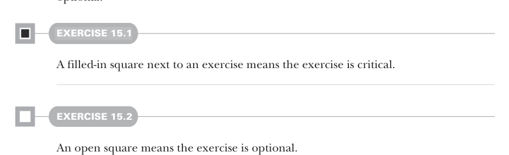

# Page 0025

[<- Page 0024](./page-0024) | [Pages index](./) | [Page 0026 ->](./page-0026)

> about this book / Code conventions and downloads

ABOUT THIS BOOK **xxiv**

Most chapters in this book have a similar structure. We introduce some new idea or technique, explain it with an example, and then work through a number of exercises. We strongly suggest you download the exercise source code and do the exercises as you go through each chapter. Exercises, hints, and answers are all available at https://github.com/fpinscala/fpinscala. We also encourage you to use the Discussions feature of GitHub for questions and discussion and join the #fpis-red-book channel on the Typelevel Discord server (https://discord.gg/vRP4FUpxWT). Exercises are marked for both their difficulty and importance. We mark exercises we consider hard or optional, but these designations are only meant to give you some idea of what to expect—you may find some unmarked questions difficult and some questions marked *hard* quite easy. The *optional* designation is for exercises that are informative but can be skipped without impeding your ability to follow further material. The exercises have the following icons in front of them to denote whether they are optional:



#### EXERCISE 15.1

A filled-in square next to an exercise means the exercise is critical.

#### EXERCISE 15.2

An open square means the exercise is optional.

Examples are presented throughout the book, and they are meant to be *tried* rather than just read. Before you begin, you should have the Scala interpreter running and ready. We encourage you to experiment on your own with variations of what you see in the examples; a good way to understand something is to change it slightly and see how the change affects the outcome. Sometimes we will show a Scala interpreter session to demonstrate the result of running or evaluating some code. This will be marked by lines beginning with the `scala>` prompt of the interpreter. Code that follows this prompt is to be typed or pasted into the interpreter, and the line just below it shows the interpreter’s response—like this:

```scala
scala> println("Hello, World!")
Hello, World!
```

### Code conventions and downloads

This book contains many examples of source code both in numbered listings and in line with normal text. In both cases, source code is formatted in a `fixed-width` `font`

[<- Page 0024](./page-0024) | [Pages index](./) | [Page 0026 ->](./page-0026)
