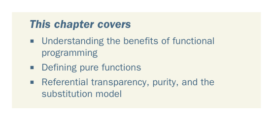

# Page 0032

[<- Page 0031](./page-0031) | [Pages index](./) | [Page 0033 ->](./page-0033)

> Part 1: Introduction to functional programming / Chapter 1: What is functional programming?

## What is functional

* programming?*

### This chapter covers

Understanding the benefits of functional programming

Defining pure functions

Referential transparency, purity, and the substitution model

Functional programming (FP) is based on a simple premise with far-reaching implications: we construct our programs using only *pure functions*—in other words, functions that have no *side effects*. But what are side effects? A function has a side effect if it does something other than simply return a result. This includes, for example, the following cases:

Modifying a variable

Modifying a data structure in place

Setting a field on an object

Throwing an exception or halting with an error

**3**

[<- Page 0031](./page-0031) | [Pages index](./) | [Page 0033 ->](./page-0033)
