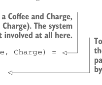
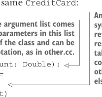
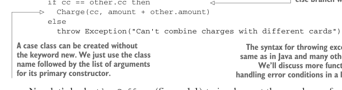
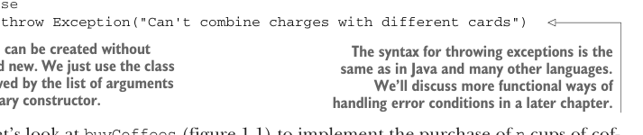
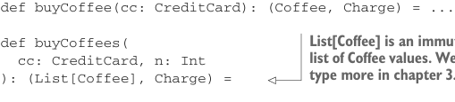

# Page 0036

[<- Page 0035](./page-0035) | [Pages index](./) | [Page 0037 ->](./page-0037)

> Part 1: Introduction to functional programming / Chapter 1: What is functional programming? / 1.1 Understanding the benefits of functional programming / 1.1.2 A functional solution: Removing the side effects

## 7 1.1 Understanding the benefits of functional programming

### 1.1.2 A functional solution: Removing the side effects

The functional solution is to eliminate side effects and have `buyCoffee` return the charge as a value in addition to returning the `Coffee`. The concerns of processing the charge by sending it off to the credit card company, persisting a record of it, and so on will be handled elsewhere. A functional solution might look like the following:



> buyCoffee now returns a pair of a Coffee and Charge, indicated with the type (Coffee, Charge). The system that processes payments is not involved at all here. To create a pair, we put the cup and Charge in parentheses, separated by a comma.

```scala
class Cafe:
def buyCoffee(cc: CreditCard): (Coffee, Charge) =
val cup = Coffee()
(cup, Charge(cc, cup.price))
```

Here we’ve separated the concern of *creating* a charge from the *processing* or *interpreta-*tion* of that charge. The `buyCoffee` function now returns a `Charge` as a value along with the `Coffee`. We’ll see shortly how this lets us reuse it more easily to purchase multiple coffees with a single transaction. But what is `Charge`? It’s a data type we just invented containing a `CreditCard` and an `amount` equipped with a handy function, `combine`, for combining charges with the same `CreditCard`:



> An if expression has a similar syntax as in Java, but it also returns a value equal to the result of whichever branch is taken. If cc == other.cc, then combine will return Charge(..); otherwise, the exception in the else branch will be thrown.

> A case class has one primary constructor whose argument list comes after the class name (Charge, in this case). The parameters in this list become public, unmodifiable (immutable) fields of the class and can be accessed using the usual object-oriented dot notation, as in other.cc.

```scala
case class Charge(cc: CreditCard, amount: Double):
def combine(other: Charge): Charge =
if cc == other.cc then
Charge(cc, amount + other.amount)
else
```





```scala
throw Exception("Can't combine charges with different cards")
```

> A case class can be created without the keyword new. We just use the class name followed by the list of arguments for its primary constructor.

> The syntax for throwing exceptions is the same as in Java and many other languages. We’ll discuss more functional ways of handling error conditions in a later chapter.

Now let’s look at `buyCoffees` (figure 1.1) to implement the purchase of `n` cups of coffee. Unlike previously, this can now be implemented in terms of `buyCoffee`, as we had hoped. Note there’s a lot of new syntax and methods in this implementation, which we’ll gradually become familiar with over the next few chapters.

Listing 1.3 Buying multiple cups with `buyCoffees`

```scala
class Cafe:
def buyCoffee(cc: CreditCard): (Coffee, Charge) = ...
```



> List[Coffee] is an immutable, singly linked list of Coffee values. We’ll discuss this data type more in chapter 3.

```scala
def buyCoffees(
cc: CreditCard, n: Int
): (List[Coffee], Charge) =
```

[<- Page 0035](./page-0035) | [Pages index](./) | [Page 0037 ->](./page-0037)
