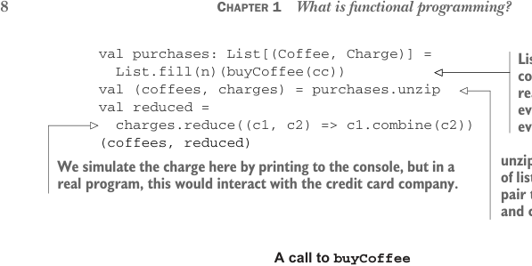
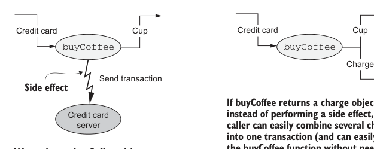

# Page 0037

[<- Page 0036](./page-0036) | [Pages index](./) | [Page 0038 ->](./page-0038)

> Part 1: Introduction to functional programming / Chapter 1: What is functional programming? / 1.1 Understanding the benefits of functional programming / 1.1.2 A functional solution: Removing the side effects



```scala
val purchases: List[(Coffee, Charge)] =
List.fill(n)(buyCoffee(cc))
val (coffees, charges) = purchases.unzip
val reduced =
charges.reduce((c1, c2) => c1.combine(c2))
(coffees, reduced)
```

> List.fill(n)(x) creates a List with n copies of x. More precisely, fill(n)(x) really returns a List with n successive evaluations of x. We’ll talk about evaluation strategies more in chapter 5.

> unzip splits a list of pairs into a pair of lists. Here we’re destructuring this pair to declare two values (coffees and charges) on one line.

> We simulate the charge here by printing to the console, but in a real program, this would interact with the credit card company.

**A call to **`buyCoffee`


**With a side effect**

**Without a side effect**



Cup Credit card Cup Credit card

```scala
buyCoffee
buyCoffee
```

Charge

Send transaction

> Side effect

> If buyCoffee returns a charge object instead of performing a side effect, a caller can easily combine several charges into one transaction (and can easily test the buyCoffee function without needing a payment processor).

Credit card server

> We can’t test buyCoffee without a credit card server; we can’t combine two transactions into one.


List (charge1, charge2,...)

Charge

Coalesce

Figure 1.1 A call to buy coffee

Overall, this solution is a marked improvement; we’re now able to reuse `buyCoffee` directly to define the `buyCoffees` function, and both functions are trivially testable without having to define complicated stub implementations of some `Payments` interface. In fact, the `Cafe` is now completely ignorant of how the `Charge` values will be processed. We can still have a `Payments` class for actually processing charges, of course, but `Cafe` doesn’t need to know about it. Making `Charge` into a first-class value has other benefits we might not have anticipated, since we can more easily assemble business logic for working with these charges. For instance, Alice may bring her laptop to the coffee shop and work there for a few hours, making occasional purchases. It might be nice if the coffee shop could combine these purchases Alice makes into a single charge, again saving on

[<- Page 0036](./page-0036) | [Pages index](./) | [Page 0038 ->](./page-0038)
