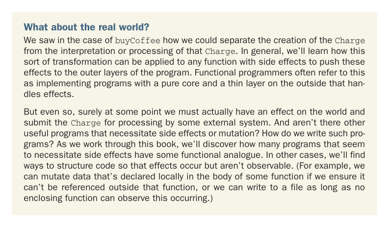

# Page 0038

[<- Page 0037](./page-0037) | [Pages index](./) | [Page 0039 ->](./page-0039)

> Part 1: Introduction to functional programming / Chapter 1: What is functional programming? / 1.1 Understanding the benefits of functional programming / 1.1.2 A functional solution: Removing the side effects

## 9 1.1 Understanding the benefits of functional programming

credit card processing fees. Since `Charge` is first-class, we can write the following function to coalesce any same-card charges in a `List[Charge]`:

```scala
def coalesce(charges: List[Charge]): List[Charge] =
charges.groupBy(_.cc).values.map(_.reduce(_.combine(_))).toList
```

We’re passing functions as values to the `groupBy`, `map`, and `reduce` methods. You’ll learn to read and write one-liners like this over the course of the next several chapters. The `_.cc` and `_.combine(_)` are syntax for *anonymous functions*, which we’ll introduce in the next chapter. As a preview, `_.cc` is equivalent to `c` `=>` `c.cc`, and `_.combine(_)` is equivalent to `(c1,` `c2)` `=>` `c1.combine(c2)`. You may find this kind of code difficult to read because the notation is very compact. But as you work through this book, reading and writing Scala code like this will become second nature very quickly. This function takes a list of charges, groups them by the credit card used, and then combines them into a single charge per card. It’s perfectly reusable and testable without any additional mock objects or interfaces. Imagine trying to implement the same logic with our first implementation of `buyCoffee`! This is just a taste of the benefits of functional programming, and this example is intentionally simple. If the series of refactorings used here seems natural, obvious, unremarkable, or standard practice, that’s good. FP is a discipline that merely takes what many consider a good idea to its logical endpoint, applying the discipline even in situations where its applicability is less obvious. As you’ll learn over the course of this book, the consequences of consistently following the discipline of FP are profound, and the benefits are enormous. FP is a truly radical shift in how programs are organized at every level—from the simplest of loops to high-level program architecture. The style that emerges is quite different, but it’s a beautiful and cohesive approach to programming that we hope you come to appreciate.



What about the real world? We saw in the case of `buyCoffee` how we could separate the creation of the `Charge` from the interpretation or processing of that `Charge`. In general, we’ll learn how this sort of transformation can be applied to any function with side effects to push these effects to the outer layers of the program. Functional programmers often refer to this as implementing programs with a pure core and a thin layer on the outside that handles effects.

But even so, surely at some point we must actually have an effect on the world and submit the `Charge` for processing by some external system. And aren’t there other useful programs that necessitate side effects or mutation? How do we write such programs? As we work through this book, we’ll discover how many programs that seem to necessitate side effects have some functional analogue. In other cases, we’ll find ways to structure code so that effects occur but aren’t observable. (For example, we can mutate data that’s declared locally in the body of some function if we ensure it can’t be referenced outside that function, or we can write to a file as long as no enclosing function can observe this occurring.)

[<- Page 0037](./page-0037) | [Pages index](./) | [Page 0039 ->](./page-0039)
