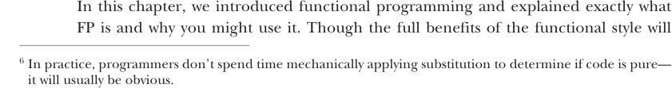

# Page 0042

[<- Page 0041](./page-0041) | [Pages index](./) | [Page 0043 ->](./page-0043)

> Part 1: Introduction to functional programming / Chapter 1: What is functional programming? / 1.4 Conclusion

## 13 1.4 Conclusion

```scala
scala> val x = new StringBuilder("Hello")
x: java.lang.StringBuilder = Hello
scala> val r1 = x.append(", World").toString
r1: java.lang.String = Hello, World
scala> val r2 = x.append(", World").toString
r2: java.lang.String = Hello, World, World
```

> r1 and r2 are no longer the same.

This transformation of the program results in a different outcome. We therefore conclude that `StringBuilder.append` is not a pure function. What’s going on here is that although `r1` and `r2` look like they’re the same expression, they are in fact referencing two different values of the same `StringBuilder`. By the time `r2` calls `x.append`, `r1` will have already mutated the object referenced by `x`. If this seems difficult to think about, that’s because it is. Side effects make reasoning about program behavior more difficult. Conversely, the substitution model is simple to reason about, since effects of evaluation are purely local (they affect only the expression being evaluated), and we need not mentally simulate sequences of state updates to understand a block of code. Understanding requires only local reasoning. We need not mentally track all the state changes that may occur before or after our function’s execution to understand what our function will do; we simply look at the function’s definition and substitute the arguments into its body. Even if you haven’t used the name *substitution model*, you have certainly used this mode of reasoning when thinking about your code. 6

Formalizing the notion of purity this way gives insight into why functional programs are often more *modular*. Modular programs consist of components that can be understood and reused independently of the whole such that the meaning of the whole depends only on the meaning of the components and the rules governing their composition; that is, they are *composable*. A pure function is modular and composable because it separates the logic of the computation itself from what to do with the result and how to obtain the input; it’s a black box. The input is obtained in exactly one way: via the argument(s) to the function. And the output is simply computed and returned. By keeping each of these concerns separate, the logic of the computation is more reusable; we may reuse the logic wherever we want without worrying about whether the side effect being performed with the result or the side effect requesting the input are appropriate in all contexts. We saw this in the `buyCoffee` example: by eliminating the side effect of payment processing being done with the output, we were more easily able to reuse the logic of the function, both for purposes of testing and further composition (like when we wrote `buyCoffees` and `coalesce`).

### 1.4 Conclusion



In this chapter, we introduced functional programming and explained exactly what FP is and why you might use it. Though the full benefits of the functional style will

6 In practice, programmers don’t spend time mechanically applying substitution to determine if code is pure— it will usually be obvious.

[<- Page 0041](./page-0041) | [Pages index](./) | [Page 0043 ->](./page-0043)
