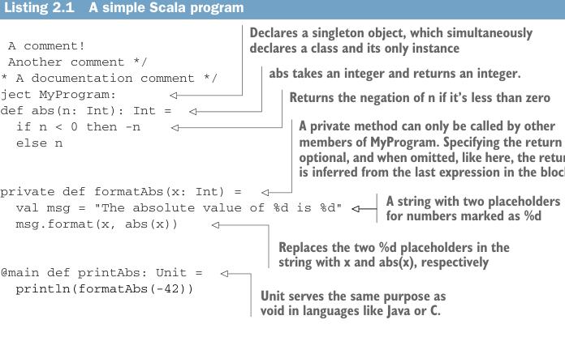

# Page 0045

[<- Page 0044](./page-0044) | [Pages index](./) | [Page 0046 ->](./page-0046)

> Part 1: Introduction to functional programming / Chapter 2: Getting started with functional programming in Scala / 2.1 Introducing Scala the language

This chapter is mainly intended for those readers who are new to Scala, functional programming, or both. Immersion is an effective method for learning a foreign language, so we’ll just dive in. The only way Scala code will look familiar rather than foreign is by looking at a lot of Scala code. We’ve already seen some in the first chapter, and in this chapter, we’ll start by looking at a small but complete program. We’ll then break it down piece by piece to examine what it does in some detail to better understand the basics of the Scala language and its syntax. Our goal in this book is to teach functional programming, but we’ll use Scala as our vehicle, and need to know enough of the Scala language and its syntax to get going. Once we’ve covered some of the basic elements of the Scala language, we’ll introduce some of the basic techniques of writing functional programs. We’ll discuss how to write loops using *tail-recursive functions*, and we’ll introduce *higher-order functions*. Higherorder functions are functions that take other functions as arguments and may themselves return functions as their output. We’ll also look at some examples of *polymorphic* higher-order functions where we use types to guide us toward an implementation. There’s a lot of new material in this chapter. Some of the material related to higher-order functions may be brain bending if you have a lot of experience programming in a language without the ability to pass functions around like that. Remember, it’s not crucial to internalize every single concept in this chapter or solve every exercise. We’ll come back to these concepts again from different angles throughout the book, and our goal here is just to give you some initial exposure.

### 2.1 Introducing Scala the language

The following is a complete program listing in Scala, which we’ll talk through. We aren’t introducing any new concepts of functional programming here. Our goal is just to introduce the Scala language and its syntax.



Listing 2.1 A simple Scala program

> Declares a singleton object, which simultaneously declares a class and its only instance

```scala
// A comment!
/* Another comment */
/** A documentation comment */
object MyProgram:
def abs(n: Int): Int =
if n < 0 then -n
else n
```

> abs takes an integer and returns an integer.

> Returns the negation of n if it’s less than zero

> A private method can only be called by other members of MyProgram. Specifying the return type is optional, and when omitted, like here, the return type is inferred from the last expression in the block.

```scala
private def formatAbs(x: Int) =
val msg = "The absolute value of %d is %d"
msg.format(x, abs(x))
```

> A string with two placeholders for numbers marked as %d

> Replaces the two %d placeholders in the string with x and abs(x), respectively

```scala
@main def printAbs: Unit =
println(formatAbs(-42))
```

> Unit serves the same purpose as void in languages like Java or C.

[<- Page 0044](./page-0044) | [Pages index](./) | [Page 0046 ->](./page-0046)
