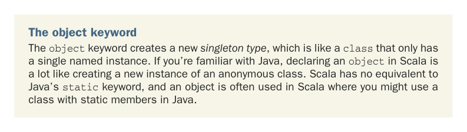
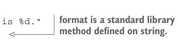

# Page 0046

[<- Page 0045](./page-0045) | [Pages index](./) | [Page 0047 ->](./page-0047)

> Part 1: Introduction to functional programming / Chapter 2: Getting started with functional programming in Scala / 2.1 Introducing Scala the language

## 17 2.1 Introducing Scala the language

We declare an object named `MyProgram`. This is simply to give our code a place to live and a name so we can refer to it later. We put our code inside the object by indenting each member.1 We’ll discuss objects and classes in greater detail shortly. For now, we’ll just look at this particular object.



The object keyword The `object` keyword creates a new *singleton type*, which is like a `class` that only has a single named instance. If you’re familiar with Java, declaring an `object` in Scala is a lot like creating a new instance of an anonymous class. Scala has no equivalent to Java’s `static` keyword, and an object is often used in Scala where you might use a class with static members in Java.

The `MyProgram` object has three *methods*, introduced with the `def` keyword: `abs`, `formatAbs`, and `printAbs`. We’ll use the term *method* to refer to some function defined within an object or class using the `def` keyword. Let’s now go through the methods of `MyProgram` one by one. The `abs` method is a pure function that takes an integer and returns its absolute value:

```scala
def abs(n: Int): Int =
if n < 0 then -n
else n
```

The `def` keyword is followed by the name of the method, which is followed by the parameter list in parentheses. In this case, `abs` takes only one argument: `n` of type `Int`. Following the closing parenthesis of the argument list, an optional type annotation (the `:` `Int`) indicates that the type of the result is `Int` (the colon may be pronounced *has type*). The body of the method itself comes after a single equals sign (`=`). We’ll sometimes refer to the part of a declaration that goes before the equals sign as the *left-hand side* or *signature* and the code that comes after the equals sign as the *right-hand* side or *defini-*tion*. Note the absence of an explicit `return` keyword. The value returned from a method is simply whatever value results from evaluating the right-hand side. All expressions, including `if` expressions, produce a result. Here the right-hand side is a single expression whose value is either `-n` or `n`, depending on whether `n` `<` `0`. The `formatAbs` method is another pure function:



```scala
private def formatAbs(x: Int) =
val msg = "The absolute value of %d is %d."
msg.format(x, abs(x))
```

> format is a standard library method defined on string.

Here we’re calling the `format` method on the `msg` object, passing in the value of `x` along with the value of `abs` applied to `x`. This results in a new string with the occurrences of `%d` in `msg` replaced with the evaluated results of `x` and `abs(x)`, respectively.

1 The `MyProgram` object is optional in this case because Scala supports top-level definitions. We could remove the `MyProgram` object entirely, but here we use the object to group the various related members together.

[<- Page 0045](./page-0045) | [Pages index](./) | [Page 0047 ->](./page-0047)
