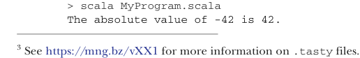

# Page 0048

[<- Page 0047](./page-0047) | [Pages index](./) | [Page 0049 ->](./page-0049)

> Part 1: Introduction to functional programming / Chapter 2: Getting started with functional programming in Scala / 2.1 Introducing Scala the language / 2.1.1 Running our program

## 19 2.1 Introducing Scala the language

The `printAbs` method is annotated with `@main`, signaling to Scala that this method is the entry point of a program. It takes no arguments, and its return type is `Unit`. Scala supports parsing program arguments, but we’re not doing that here. `Unit` serves a similar purpose to `void` in programming languages like C and Java. In Scala, every method has to return some value as long as it doesn’t crash or hang. But `printAbs` doesn’t return anything meaningful, so there’s a special type, `Unit`, that is the return type of such methods. There’s only one value of this type, and the literal syntax for it is `()`, a pair of empty parentheses (pronounced *unit*, just like the type). Usually, a return type of `Unit` is a hint that the method has a side effect. The body of our `printAbs` method prints the `String` returned by the call to `formatAbs` to the console. Note that the return type of `println` is `Unit`, which happens to be what we need to return from `printAbs`.

### 2.1.1 Running our program

This section discusses the simplest possible way of running your Scala programs, suitable for short examples. More typically, you’ll build and run your Scala code using either `scala-cli`, a command-line tool for interacting with Scala, or `sbt`, a popular build tool for Scala. Alternatively, you might use an IDE like IntelliJ or Visual Studio Code. There are also various web-based options, like Scastie (http://scastie.scala-lang.org). See the book’s source code repo on GitHub (https://github.com/fpinscala/fpinscala) for more information on getting set up with `scala-cli` and `sbt`. The simplest way we can run this Scala program is from the command line by invoking the Scala compiler directly ourselves. First download the Scala 3 compiler from the official Scala website at https://docs.scala-lang.org/getting-started. Once Scala is installed, we start by putting the code in a file called MyProgram.scala or something similar. We can then compile it to Java bytecode using the `scalac` compiler:

```scala
> scalac MyProgram.scala
```

This will generate some files ending with the `.class` suffix and others ending with the `.tasty` suffix.3 These files contain compiled code that can be run with the Java Virtual Machine (JVM). The code can be executed using the `scala` command-line tool, specifying the name of the `@main` method to run:

```scala
> scala printAbs
The absolute value of -42 is 42.
```

Actually, it’s not strictly necessary to compile the code first with `scalac`. A simple program like the one we’ve written here can be run using just the Scala interpreter by passing it to the `scala` command-line tool directly:



```scala
> scala MyProgram.scala
The absolute value of -42 is 42.
```

3 See https://mng.bz/vXX1 for more information on `.tasty` files.

[<- Page 0047](./page-0047) | [Pages index](./) | [Page 0049 ->](./page-0049)
