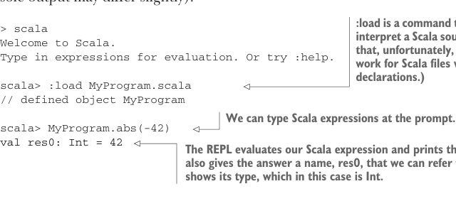

# Page 0049

[<- Page 0048](./page-0048) | [Pages index](./) | [Page 0050 ->](./page-0050)

> Part 1: Introduction to functional programming / Chapter 2: Getting started with functional programming in Scala / 2.2 Objects and namespaces

This can be handy when using Scala for scripting. The interpreter will look for any object within the MyProgram.scala file that has an `@main` method with the appropriate signature, and then it will call it. An alternative approach is using the Scala interpreter’s interactive mode, the REPL, which can be started by running `scala` with no arguments. It’s a great idea to have a REPL window open so you can try things out while you’re programming in Scala. We can load our source file into the REPL and try things out (your actual console output may differ slightly):



> :load is a command to the REPL to interpret a Scala source file. (Note that, unfortunately, this won’t work for Scala files with package declarations.)

```scala
> scala
Welcome to Scala.
Type in expressions for evaluation. Or try :help.
scala> :load MyProgram.scala
// defined object MyProgram
```

> We can type Scala expressions at the prompt.

```scala
scala> MyProgram.abs(-42)
val res0: Int = 42
```

> The REPL evaluates our Scala expression and prints the answer. It also gives the answer a name, res0, that we can refer to later and shows its type, which in this case is Int.

It’s also possible to copy and paste lines of code into the REPL. It’s a good idea to get familiar with the REPL and its features because it’s a tool you’ll use a lot as a Scala programmer. To exit the REPL type `:quit` or press Ctrl-D or Ctrl-C.

### 2.2 Objects and namespaces

In this section, we’ll discuss some additional aspects of Scala’s syntax related to objects and namespaces. In the preceding REPL session, to refer to our `abs` method, we had to say `MyProgram.abs` because `abs` was defined in the `MyProgram` object. We say that `MyProgram` is its *namespace*. Aside from some technicalities, every value in Scala is what’s called an *object*,4 and each object may have zero or more *members*. A member can be a method declared with the `def` keyword, or it can be another object declared with `val` or `object`. Objects can also have other kinds of members, which we’ll ignore for now. We access the members of objects with the typical object-oriented dot notation, which is a namespace (the name that refers to the object) followed by a dot (the period character), and then followed by the name of the member, as in `MyProgram` `.abs(-42)`. To use the `toString` member on the object `42`, we use `42.toString`. The implementations of members within an object can refer to each other unqualified (without prefixing the object name), but if needed, they have access to their enclosing object using a special name: `this`.5

4 Unlike in Java, values of primitive types like `Int` are also considered objects for the purposes of this discussion. 5 Note that in this book, we’ll use the term *function* to refer more generally to either so-called standalone functions like `sqrt` or `abs` or members of some class, including methods. When it’s clear from the context, we’ll also use the terms *method* and *function* interchangeably, since what matters is not the syntax of invocation (i.e., `obj.method(12)` vs. `method(obj,` `12)` but the fact that we’re talking about some parameterized block of code.

[<- Page 0048](./page-0048) | [Pages index](./) | [Page 0050 ->](./page-0050)
