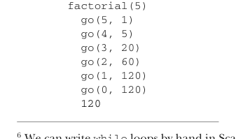

# Page 0051

[<- Page 0050](./page-0050) | [Pages index](./) | [Page 0052 ->](./page-0052)

> Part 1: Introduction to functional programming / Chapter 2: Getting started with functional programming in Scala / 2.3 Higher-order functions: Passing functions to functions / 2.3.1 A short detour: Writing loops functionally

We write loops functionally, without mutating a loop variable, by using a recursive function. Here we’re defining a recursive helper function inside the body of the `factorial` function. Such a helper function is often called `go` or `loop` by convention. In Scala, we can define functions inside any block, including within another function definition. Since it’s local, the `go` function can only be referred to from within the body of the `factorial` function, just like a local variable would. The definition of `factorial`, finally, just consists of a call to `go` with the initial conditions for the loop. The arguments to `go` are the state for the loop. In this case, they’re the remaining value `n` and the current accumulated factorial `acc`. To advance to the next iteration, we call `go` recursively with the new loop state (here, `go(n` `-` `1,` `n` `*` `acc)`), and to exit from the loop, we return a value without a recursive call (here, we return `acc` in the case that `n` `<=` `0`). Scala detects this sort of *self-recursion* and compiles it to the same sort of bytecode as would be emitted for a `while` loop,6 so long as the recursive call is in *tail* *position*. See the sidebar for the technical details on this, but the basic idea is that this optimization7 (called *tail call elimination*) is applied when there’s no additional work left to do after the recursive call returns. We can manually trace the execution of a recursive function to get a better understanding how evaluation proceeds. An execution trace of `factorial(5)` might look like the following:

```scala
factorial(5)
go(5, 1)
go(4, 5)
go(3, 20)
go(2, 60)
go(1, 120)
go(0, 120)
120
```

In this trace, each recursive call increases the indent level of the trace. We may choose to render tail recursive calls without increasing the indent level. Since the recursive call in `go` is in tail position, we could write the trace as



```scala
factorial(5)
go(5, 1)
go(4, 5)
go(3, 20)
go(2, 60)
go(1, 120)
go(0, 120)
120
```

6 We can write `while` loops by hand in Scala, but it’s rarely necessary and considered bad form, since it hinders good compositional style. 7 The term *optimization* is not really appropriate here. An optimization usually connotes some nonessential performance improvement, but when we use tail calls to write loops, we generally rely on them being compiled as iterative loops that don’t consume a call stack frame for each iteration (which would result in a `StackOverflowError` for large inputs).

[<- Page 0050](./page-0050) | [Pages index](./) | [Page 0052 ->](./page-0052)
