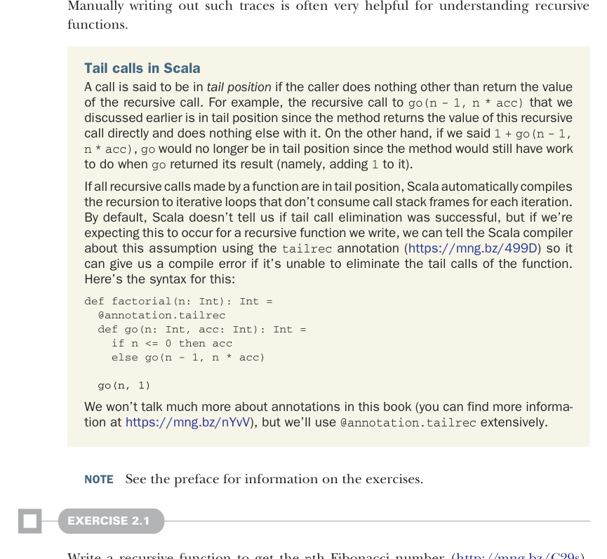

# Page 0052

[<- Page 0051](./page-0051) | [Pages index](./) | [Page 0053 ->](./page-0053)

> Part 1: Introduction to functional programming / Chapter 2: Getting started with functional programming in Scala / 2.3 Higher-order functions: Passing functions to functions / 2.3.1 A short detour: Writing loops functionally

## 23 2.3 Higher-order functions: Passing functions to functions



Manually writing out such traces is often very helpful for understanding recursive functions.

Tail calls in Scala A call is said to be in *tail position* if the caller does nothing other than return the value of the recursive call. For example, the recursive call to `go(n` `-` `1,` `n` `*` `acc)` that we discussed earlier is in tail position since the method returns the value of this recursive call directly and does nothing else with it. On the other hand, if we said `1` `+` `go(n` `-` `1,` `n` `*` `acc)`, `go` would no longer be in tail position since the method would still have work to do when `go` returned its result (namely, adding `1` to it).

If all recursive calls made by a function are in tail position, Scala automatically compiles the recursion to iterative loops that don’t consume call stack frames for each iteration. By default, Scala doesn’t tell us if tail call elimination was successful, but if we’re expecting this to occur for a recursive function we write, we can tell the Scala compiler about this assumption using the `tailrec` annotation (https://mng.bz/499D) so it can give us a compile error if it’s unable to eliminate the tail calls of the function. Here’s the syntax for this:

```scala
def factorial(n: Int): Int =
@annotation.tailrec
def go(n: Int, acc: Int): Int =
if n <= 0 then acc
else go(n - 1, n * acc)
go(n, 1)
```

We won’t talk much more about annotations in this book (you can find more information at https://mng.bz/nYvV), but we’ll use `@annotation.tailrec` extensively.

NOTE See the preface for information on the exercises.

#### EXERCISE 2.1

Write a recursive function to get the `n`th Fibonacci number (http://mng.bz/C29s). The first two Fibonacci numbers are `0` and `1`. The `n`th number is always the sum of the previous two—the sequence begins `0,` `1,` `1,` `2,` `3,` `5`. Your definition should use a local, tail-recursive function:

```scala
def fib(n: Int): Int
```

[<- Page 0051](./page-0051) | [Pages index](./) | [Page 0053 ->](./page-0053)
