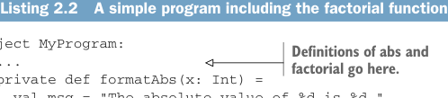
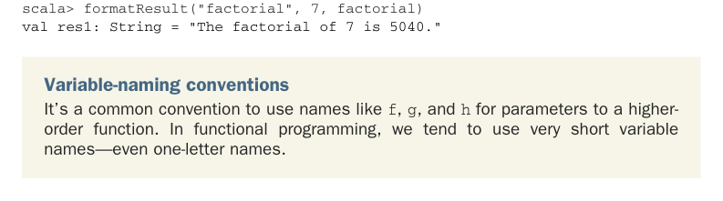

# Page 0053

[<- Page 0052](./page-0052) | [Pages index](./) | [Page 0054 ->](./page-0054)

> Part 1: Introduction to functional programming / Chapter 2: Getting started with functional programming in Scala / 2.3 Higher-order functions: Passing functions to functions / 2.3.2 Writing our first higher-order function

### 2.3.2 Writing our first higher-order function

Now that we have `factorial`, let’s edit our previous program to include it.

Listing 2.2 A simple program including the factorial function



```scala
object MyProgram:
...
private def formatAbs(x: Int) =
val msg = "The absolute value of %d is %d."
msg.format(x, abs(x))
```

> Definitions of abs and factorial go here.

```scala
private def formatFactorial(n: Int) =
val msg = "The factorial of %d is %d."
msg.format(n, factorial(n))
@main def printAbsAndFactorial: Unit =
println(formatAbs(-42))
println(formatFactorial(7))
```

The two functions, `formatAbs` and `formatFactorial`, are almost identical. If we like, we can generalize these to a single function, `formatResult`, which accepts the function as an argument to apply to its argument:

> f is required to be a function from Int to Int.

```scala
def formatResult(name: String, n: Int, f: Int => Int) =
val msg = "The %s of %d is %d."
msg.format(name, n, f(n))
```

Our `formatResult` function is a higher-order function that takes another function, called `f` (see the variable-naming conventions sidebar). We give a type to `f`, as we would for any other parameter. Its type is `Int` `=>` `Int` (pronounced *int to int* or *a func-*tion from int to int*), which indicates that `f` expects an integer argument and will also return an integer. Our previous `abs` function matches that type: it accepts an `Int` and returns an `Int`. Likewise, `factorial` accepts an `Int` and returns an `Int`, which also matches the `Int` `=>` `Int` type. We can therefore pass `abs` or `factorial` as the `f` argument to `formatResult`:

```scala
scala> formatResult("absolute value", -42, abs)
val res0: String = "The absolute value of -42 is 42."
```



```scala
scala> formatResult("factorial", 7, factorial)
val res1: String = "The factorial of 7 is 5040."
```

Variable-naming conventions It’s a common convention to use names like `f`, `g`, and `h` for parameters to a higherorder function. In functional programming, we tend to use very short variable names—even one-letter names.

[<- Page 0052](./page-0052) | [Pages index](./) | [Page 0054 ->](./page-0054)
