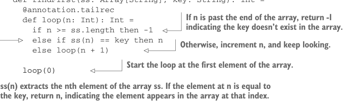
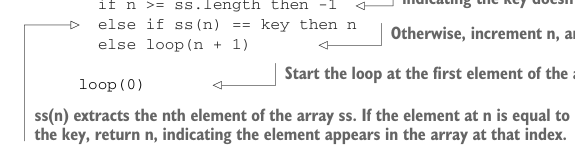

# Page 0054

[<- Page 0053](./page-0053) | [Pages index](./) | [Page 0055 ->](./page-0055)

> Part 1: Introduction to functional programming / Chapter 2: Getting started with functional programming in Scala / 2.4 Polymorphic functions: Abstracting over types / 2.4.1 An example of a polymorphic function


## 25 2.4 Polymorphic functions: Abstracting over types

This is usually because higher-order functions are so general that they have no opinion on what the argument should actually do. All they know about the argument is its type. Many functional programmers feel that short names make code easier to read since they make the structure of the code easier to see at a glance.

### 2.4 Polymorphic functions: Abstracting over types

So far we’ve defined only *monomorphic* functions, or functions that operate on only one type of data. For example, `abs` and `factorial` are specific to arguments of type `Int`, and the higher-order function `formatResult` is also fixed to operate on functions that take arguments of type `Int`. Often, and especially when writing higher-order functions, we want to write code that works for any type it’s given. These are called *polymor-*phic functions*,8 and in the chapters ahead, you’ll get plenty of experience writing such functions. Here we’ll just introduce the idea.

### 2.4.1 An example of a polymorphic function We can often discover polymorphic functions by observing that several monomorphic functions all share a similar structure. For example, the following monomorphic function, findFirst, returns the first index in an array where the key occurs, or -1 if it’s not found. It’s specialized for searching for a String in an Array of String values.

Listing 2.3 Monomorphic function to find a `String` in an array

```scala
def findFirst(ss: Array[String], key: String): Int =
@annotation.tailrec
def loop(n: Int): Int =
if n >= ss.length then -1
else if ss(n) == key then n
else loop(n + 1)
```



> If n is past the end of the array, return -1 indicating the key doesn’t exist in the array.



> Otherwise, increment n, and keep looking.

> Start the loop at the first element of the array.

```scala
loop(0)
```

> ss(n) extracts the nth element of the array ss. If the element at n is equal to the key, return n, indicating the element appears in the array at that index.

The details of the code aren’t too important here. What’s important is that the code for `findFirst` will look almost identical if we’re searching for a `String` in an `Array[String]`, an `Int` in an `Array[Int]`, or an `A` in an `Array[A]` for any given type `A`. We can write `findFirst` more generally for any type `A` by accepting a function to use for testing a particular `A` value. Note that this last generalization isn’t strictly necessary—we could instead just take the target key, of type `A`, to search for. But doing so assumes the type has a useful `equals` method, which may not be true.

8 We’re using the term *polymorphism* in a slightly different way than you might be used to if you’re familiar with object-oriented programming, where that term usually connotes some form of subtyping or inheritance relationship. There are no interfaces or subtyping in this example. The kind of polymorphism we’re using here is sometimes called *parametric polymorphism*.

[<- Page 0053](./page-0053) | [Pages index](./) | [Page 0055 ->](./page-0055)
