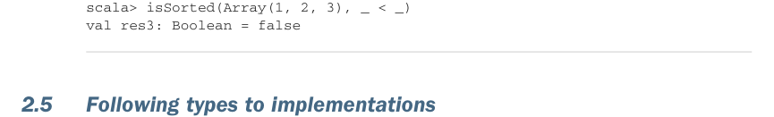

# Page 0056

[<- Page 0055](./page-0055) | [Pages index](./) | [Page 0057 ->](./page-0057)

> Part 1: Introduction to functional programming / Chapter 2: Getting started with functional programming in Scala / 2.5 Following types to implementations

## 27 2.5 Following types to implementations

In general, the arguments to the function are declared to the left of the `=>` arrow, and we can then use them in the body of the function to the right of the arrow. For example, if we want to write an equality function that takes two integers and checks if they’re equal to each other, we could write that like this:

```scala
scala> (x: Int, y: Int) => x == y
val res0: (Int, Int) => Boolean = Lambda$1240/0x00000008006dc840@121cf6f4
```

The `(Int,` `Int)` `=>` `Boolean` notation given by the REPL indicates that the value of `res0` is a function that takes two integer arguments and returns a Boolean. The `Lambda$1240/0x00000008006dc840@121cf6f4` is a string representation of the function instance obtained by calling `toString`. The string value is not very useful, and we generally ignore it. When the type of the function’s inputs can be inferred by Scala from the context, the type annotations on the function’s arguments may be elided— for example, `(x,y) => x < y`. We’ll see an example of this in the next section and lots more examples throughout the book.


#### EXERCISE 2.2

Implement `isSorted`, which checks whether an `Array[A]` is sorted according to a given comparison function, `gt`, which returns true if the first parameter is greater than the second parameter:

```scala
def isSorted[A](as: Array[A], gt: (A, A) => Boolean): Boolean
```

Your implementation of `isSorted` should return the following results:

```scala
scala> isSorted(Array(1, 2, 3), _ > _)
val res0: Boolean = true
scala> isSorted(Array(1, 2, 1), _ > _)
val res1: Boolean = false
scala> isSorted(Array(3, 2, 1), _ < _)
val res2: Boolean = true
```



```scala
scala> isSorted(Array(1, 2, 3), _ < _)
val res3: Boolean = false
```

### 2.5 Following types to implementations

As you might have seen when writing `isSorted`, the universe of possible implementations is significantly reduced when implementing a polymorphic function. If a function is polymorphic in some type `A`, the only operations that can be performed on that `A` are those passed into the function as arguments (or that can be defined in terms of these

[<- Page 0055](./page-0055) | [Pages index](./) | [Page 0057 ->](./page-0057)
