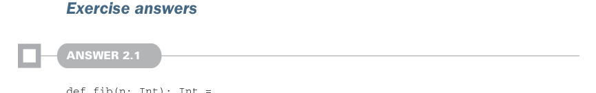
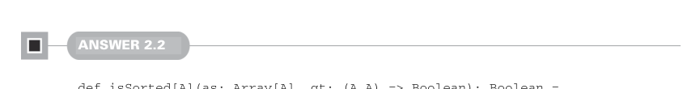

# Page 0061

[<- Page 0060](./page-0060) | [Pages index](./) | [Page 0062 ->](./page-0062)

> Part 1: Introduction to functional programming / Chapter 2: Getting started with functional programming in Scala / 2.6 Conclusion



### Exercise answers

#### ANSWER 2.1

```scala
def fib(n: Int): Int =
@annotation.tailrec
def go(n: Int, current: Int, next: Int): Int =
if n <= 0 then current
else go(n - 1, next, current + next)
go(n, 0, 1)
```

Like `factorial`, we define a local tail recursive function called `go`, which recurses on `n`, decrementing by 1 on each recursive call. Besides `n`, the `go` function takes parameters specifying the current (nth) and next (nth + 1) Fibonacci numbers. When `n` reaches 0, we’ve computed the `n`th value and simply return the current Fibonacci number. Otherwise, we recurse, shifting the next Fibonacci number into the current position and computing the new next as the sum of the Fibonacci numbers passed to this iteration.



#### ANSWER 2.2

```scala
def isSorted[A](as: Array[A], gt: (A,A) => Boolean): Boolean =
@annotation.tailrec
def loop(n: Int): Boolean =
if n + 1 >= as.length then true
else if gt(as(n), as(n + 1)) then false
else loop(n + 1)
loop(0)
```

This implementation is very similar to the definition of `findFirst`, using a local tail recursive function to iterate through the elements of an array. We call the `gt` function with the `n`th and `n`th + 1 elements of the array, returning `false` if the `n`th element is greater than the `n`th + 1 element. Otherwise, we recurse, terminating recursion when we’ve reached the end of the array.

[<- Page 0060](./page-0060) | [Pages index](./) | [Page 0062 ->](./page-0062)
