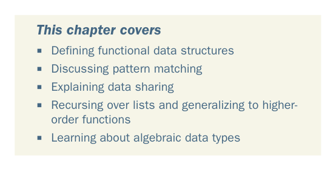

# Page 0063

[<- Page 0062](./page-0062) | [Pages index](./) | [Page 0064 ->](./page-0064)

> Part 1: Introduction to functional programming / Chapter 3: Functional data structures

## Functional data structures

### This chapter covers

Defining functional data structures

Discussing pattern matching

Explaining data sharing

Recursing over lists and generalizing to higherorder functions

Learning about algebraic data types

We said in the introduction that functional programs don’t update variables or modify mutable data structures. This raises pressing questions: What sort of data structures can we use in functional programming? How do we define them in Scala? And how do we operate on them? In this chapter, we’ll learn the concept of *functional data structures* and how to work with them. We’ll use this as an opportunity to introduce how data types are defined in functional programming, learn about the related technique of *pattern matching*, and get practice writing and generalizing pure functions.

**34**

[<- Page 0062](./page-0062) | [Pages index](./) | [Page 0064 ->](./page-0064)
