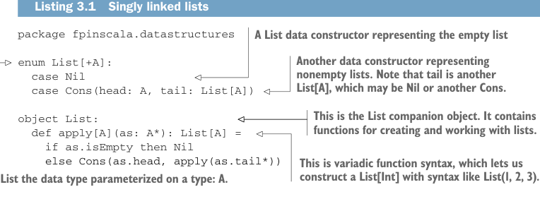

# Page 0064

[<- Page 0063](./page-0063) | [Pages index](./) | [Page 0065 ->](./page-0065)

> Part 1: Introduction to functional programming / Chapter 3: Functional data structures / 3.1 Defining functional data structures

## 35 3.1 Defining functional data structures

This chapter has many exercises, particularly dealing with writing and generalizing pure functions. Some of these exercises may be challenging; the answers are provided, but try to work through each exercise before looking at the answer, as these techniques require practice to fully grasp. You can also consult our GitHub site (https://github.com/fpinscala/fpinscala), which provides a build environment for the exercises and answers.

### 3.1 Defining functional data structures

A functional data structure is (not surprisingly) operated on using only pure functions. Remember, a pure function must not change data in place or perform other side effects. Therefore, functional data structures are, by definition, immutable. For example, the empty list (written `List()` or `Nil` in Scala) is as eternal and immutable as the integer values `3` or `4`. And just as evaluating `3` `+` `4` results in a new number, `7`, without modifying either `3` or `4`, concatenating two lists together (the syntax for this is `a` `++` `b` for two lists `a` and `b`) yields a new list and leaves the two inputs unmodified. Doesn’t this mean we end up doing a lot of extra copying of the data? Perhaps surprisingly, the answer is no, and we’ll talk about exactly why that is. But first, let’s examine what is likely the most ubiquitous functional data structure: the singly linked list. The definition here is identical in spirit to (though simpler than) the `List` data type defined in Scala’s standard library. Throughout this chapter, we’ll develop and use our own `List` data type, though subsequent chapters will use the built-in `List`. The following listing introduces a lot of new syntax and concepts, which we’ll talk through in detail.



Listing 3.1 Singly linked lists

```scala
package fpinscala.datastructures
```

> A List data constructor representing the empty list

> Another data constructor representing nonempty lists. Note that tail is another List[A], which may be Nil or another Cons.

```scala
enum List[+A]:
case Nil
case Cons(head: A, tail: List[A])
```

> This is the List companion object. It contains functions for creating and working with lists.

```scala
object List:
def apply[A](as: A*): List[A] =
if as.isEmpty then Nil
else Cons(as.head, apply(as.tail*))
```

> This is variadic function syntax, which lets us construct a List[Int] with syntax like List(1, 2, 3).

> List the data type parameterized on a type: A.

Let’s look first at the definition of the data type, which begins with the keyword `enum`. An `enum` is a data type that consists of a series of *data constructors*, each defined by the `case` keyword. Scala enumerations are similar to enumerations from Java or C, but instead of being limited to a set of values (e.g., `Red,` `Green,` `Blue`), Scala enumerations can have data constructors that take arbitrary arguments.1

1 Enumerations were introduced in Scala 3. In Scala 2, we used a `sealed trait` and a series of `case class` and `case object` instead, where each case was a subtype of the trait. See the enums versus sealed traits section at the end of this chapter for more information.

[<- Page 0063](./page-0063) | [Pages index](./) | [Page 0065 ->](./page-0065)
