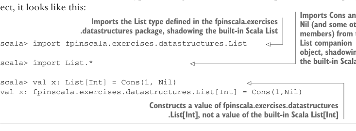

# Page 0069

[<- Page 0068](./page-0068) | [Pages index](./) | [Page 0070 ->](./page-0070)

> Part 1: Introduction to functional programming / Chapter 3: Functional data structures / 3.3 Data sharing in functional data structures

What determines if a pattern matches an expression? A pattern may contain *literals*, like `3` or `"hi"`; *variables*, like `x` and `xs`, which match anything, indicated by an identifier starting with a lowercase letter or underscore; and data constructors, like `Cons(x,` `xs)` and `Nil`, which match only values of the corresponding form. (`Nil` as a pattern matches only the value `Nil`, and `Cons(h,` `t)` or `Cons(x,` `xs)` as a pattern only matches `Cons` values.) These components of a pattern may be nested arbitrarily; `Cons(x1,` `Cons(x2,` `Nil))` and `Cons(y1,` `Cons(y2,` `Cons(y3,` `_)))` are valid patterns. A pattern matches the target if there exists an assignment of variables in the pattern to subexpressions of the target that make it *structurally equivalent* to the target. The resulting expression for a matching case will then have access to these variable assignments in its local scope.


#### EXERCISE 3.1

What will be the result of the following match expression?

```scala
import List.*
```

> This allows us to write Cons and Nil instead of List.Cons and List.Nil.

```scala
val result = List(1,2,3,4,5) match
case Cons(x, Cons(2, Cons(4, _))) => x
case Nil => 42
case Cons(x, Cons(y, Cons(3, Cons(4, _)))) => x + y
case Cons(h, t) => h + sum(t)
case _ => 101
```

You’re strongly encouraged to try experimenting with pattern matching in the REPL to get a sense of how it behaves. When working in the REPL, it is convenient to import all the members of the `List` companion object via `import` `List.*` to enable writing `Cons(1,` `Nil)` instead of `List.Cons(1,` `List.Nil)`. When working in the REPL, take care to import the `List` type defined in this chapter instead of the built-in `List` type. If using the code in the companion GitHub project, it looks like this:



> Imports Cons and Nil (and some other members) from the List companion object, shadowing the built-in Scala Nil

> Imports the List type defined in the fpinscala.exercises.datastructures package, shadowing the built-in Scala List

```scala
scala> import fpinscala.exercises.datastructures.List
scala> import List.*
scala> val x: List[Int] = Cons(1, Nil)
val x: fpinscala.exercises.datastructures.List[Int] = Cons(1,Nil)
```

> Constructs a value of fpinscala.exercises.datastructures.List[Int], not a value of the built-in Scala List[Int]

### 3.3 Data sharing in functional data structures When data is immutable, how do we write functions that, for example, add or remove elements from a list? The answer is simple. When we add an element 1 to the front of

[<- Page 0068](./page-0068) | [Pages index](./) | [Page 0070 ->](./page-0070)
