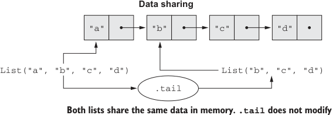

# Page 0070

[<- Page 0069](./page-0069) | [Pages index](./) | [Page 0071 ->](./page-0071)

> Part 1: Introduction to functional programming / Chapter 3: Functional data structures / 3.3 Data sharing in functional data structures

## 41 3.3 Data sharing in functional data structures

an existing list, say `xs`, we return a new list—in this case, `Cons(1,` `xs)`. Since lists are immutable, we don’t need to actually copy `xs`; we can just reuse it. This is called *data* *sharing*. Sharing of immutable data often lets us implement functions more efficiently; we can always return immutable data structures without having to worry about subsequent code modifying our data. There’s no need to pessimistically make copies to avoid modification or corruption.6

In the same way, to remove an element from the front of a list `val` `mylist` `=` `Cons(x,` `xs)`, we simply return its tail, `xs`. There’s no real removing going on. The original list, `mylist`, is still available, unharmed. We say that functional data structures are *persistent*, meaning existing references are never changed by operations on the data structure. Data sharing is depicted in figure 3.3.



**Data sharing**

```scala
"a"
"b"
"c"
"d"
List("a", "b", "c", "d")
List("b", "c", "d")
.tail
```

> Both lists share the same data in memory..tail does not modify the original list; it simply references the tail of the original list. Defensive copying is not needed because the list is immutable.

Figure 3.3 Data sharing of lists


Let’s try implementing a few different functions for modifying lists in different ways. You can place this, and other functions we write, inside the `List` companion object.

#### EXERCISE 3.2

Implement the function `tail` for removing the first element of a `List` (note that the function takes constant time). You can use `sys.error("message")` to throw an exception if the `List` is `Nil`. In the next chapter, we’ll look at different ways of handling errors. Be careful to use the `List` enum and the `Nil` case defined here and not the built-in Scala `List` and `Nil` types.

6 Pessimistic copying can become a problem in large programs. When mutable data is passed through a chain of loosely coupled components, each component has to make its own copy of the data because other components might modify it. Immutable data is always safe to share, so we never have to make copies. We find that, in the large, FP can often achieve greater efficiency than approaches that rely on side effects due to much greater sharing of data and computation.

[<- Page 0069](./page-0069) | [Pages index](./) | [Page 0071 ->](./page-0071)
