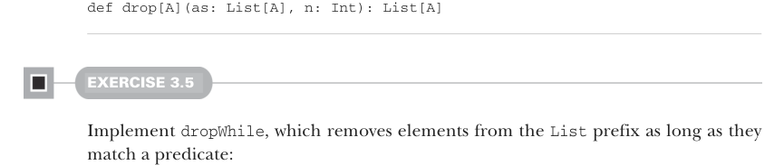

# Page 0071

[<- Page 0070](./page-0070) | [Pages index](./) | [Page 0072 ->](./page-0072)

> Part 1: Introduction to functional programming / Chapter 3: Functional data structures / 3.3 Data sharing in functional data structures / 3.3.1 The efficiency of data sharing


#### EXERCISE 3.3

Using the same idea, implement the function `setHead` for replacing the first element of a `List` with a different value.

### 3.3.1 The efficiency of data sharing


Data sharing often lets us implement operations more efficiently. Let’s look at a few examples.

#### EXERCISE 3.4

Implement the function `drop`, which removes the first `n` elements from a list. Dropping `n` elements from an empty list should return the empty list. Note that this function takes time proportional only to the number of elements being dropped—we don’t need to make a copy of the entire `List`:



```scala
def drop[A](as: List[A], n: Int): List[A]
```

#### EXERCISE 3.5

Implement `dropWhile`, which removes elements from the `List` prefix as long as they match a predicate:

```scala
def dropWhile[A](as: List[A], f: A => Boolean): List[A]
```

A more surprising example of data sharing is the following function, which adds all the elements of one list to the end of another:

```scala
def append[A](a1: List[A], a2: List[A]): List[A] =
a1 match
case Nil => a2
case Cons(h, t) => Cons(h, append(t, a2))
```

Note that this definition only copies values until the first list is exhausted, so its runtime and memory usage are determined only by the length of `a1`. The remaining list then just points to `a2`. If we were to implement this same function for two arrays, we’d be forced to copy all the elements in both arrays into the result. In this case, the immutable linked list is much more efficient than an array!

[<- Page 0070](./page-0070) | [Pages index](./) | [Page 0072 ->](./page-0072)
