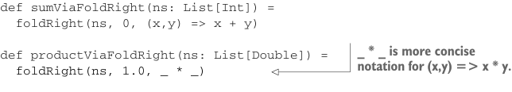

# Page 0073

[<- Page 0072](./page-0072) | [Pages index](./) | [Page 0074 ->](./page-0074)

> Part 1: Introduction to functional programming / Chapter 3: Functional data structures / 3.3 Data sharing in functional data structures / 3.3.2 Recursion over lists and generalizing to higher-order functions

will take as arguments the value to return in the case of the empty list and the function to add an element to the result in the case of a nonempty list.7

Listing 3.2 Right folds and simple uses

```scala
def foldRight[A, B](as: List[A], acc: B, f: (A, B) => B): B =
as match
case Nil => acc
case Cons(x, xs) => f(x, foldRight(xs, acc, f))
def sumViaFoldRight(ns: List[Int]) =
foldRight(ns, 0, (x,y) => x + y)
```



> _ * _ is more concise notation for (x,y) => x * y.

```scala
def productViaFoldRight(ns: List[Double]) =
foldRight(ns, 1.0, _ * _)
```

`foldRight` is not specific to any one type of element, and we discover while generalizing that the value that’s returned doesn’t have to be of the same type as the elements of the list! One way of describing what `foldRight` does is that it replaces the constructors of the list, `Nil` and `Cons`, with `acc` and `f`, as illustrated here:

```scala
Cons(1, Cons(2, Nil))
f
(1, f
(2, acc))
```

Let’s look at a complete example. We’ll trace the evaluation of `foldRight(Cons(1,` `Cons(2,` `Cons(3,` `Nil))),` `0)((x,y)` `=>` `x` `+` `y)` by repeatedly substituting the definition of `foldRight` for its usages. We’ll use program traces like this throughout the book:

```scala
foldRight(Cons(1, Cons(2, Cons(3, Nil))), 0, (x,y) => x + y)
1 + foldRight(Cons(2, Cons(3, Nil)), 0, (x,y) => x + y)
1 + (2 + foldRight(Cons(3, Nil), 0, (x,y) => x + y))
1 + (2 + (3 + (foldRight(Nil, 0, (x,y) => x + y))))
1 + (2 + (3 + (0)))
6
```

> Replace foldRight with its definition.

Note that `foldRight` must traverse all the way to the end of the list (pushing frames onto the call stack as it goes) before it can begin collapsing it. In fact, the name `fold-` `Right` is a reference to the way collapsing each element begins at the rightmost end of the list and works its way back toward the start.

7 In the Scala standard library, `foldRight` is a method on `List`, and its arguments are curried, resulting in usage like `as.foldRight(acc)(f)`. Type inference in Scala 2 worked on each parameter list to a function in succession—meaning the type of `acc` would be inferred and then constrain the type of `f`. In Scala 3, type inference is not limited in this manner, and hence, there’s less motivation for defining multiple parameter lists. However, there’s still a syntax advantage to defining higher-order functions to take their final function argument as a distinct parameter list. Doing so allows syntax like `as.foldRight(acc):` `a` `=>` `…` or `as.foldRight(acc)` `{` `a` `=>` `…` `}`.

[<- Page 0072](./page-0072) | [Pages index](./) | [Page 0074 ->](./page-0074)
