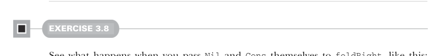

# Page 0074

[<- Page 0073](./page-0073) | [Pages index](./) | [Page 0075 ->](./page-0075)

> Part 1: Introduction to functional programming / Chapter 3: Functional data structures / 3.3 Data sharing in functional data structures / 3.3.2 Recursion over lists and generalizing to higher-order functions


## 45 3.3 Data sharing in functional data structures

Underscore notation for anonymous functions The anonymous function `(x,y)` `=>` `x` `+` `y` can be written as `_` `+` `_` in situations where the types of `x` and `y` could be inferred by Scala. This is a useful shorthand in cases where the function parameters are mentioned just once in the body of the function. Each underscore in an anonymous function expression like `_` `+` `_` introduces a new (unnamed) function parameter and references it. Arguments are introduced in left-to-right order. Here are a few more examples:

> (x, y) => x + y

```scala
_ + _
```

> x => x * 2

```scala
_ * 2
```

> xs => xs.head

```scala
_.head
```

> (xs, n) => xs.drop(n)

```scala
_ drop _
```

Use this syntax judiciously. Its meaning in expressions like `foo(_,` `g(List(_` `+` `1),` `_))` can be unclear. There are precise rules about the scoping of these underscorebased anonymous functions in the Scala language specification, but if you have to think about it we recommend just using ordinarily named function parameters.

#### EXERCISE 3.7

Can `product`, implemented using `foldRight`, immediately halt the recursion and return `0.0` if it encounters a `0.0`? Why or why not? Consider how any short circuiting might work if you call `foldRight` with a large list. This is a deeper question, which we’ll return to in chapter 5.



#### EXERCISE 3.8

See what happens when you pass `Nil` and `Cons` themselves to `foldRight`, like this: `foldRight(List(1,` `2,` `3),` `Nil:` `List[Int],` `Cons(_,` `_))`.8 What do you think this says about the relationship between `foldRight` and the data constructors of `List`?

8 The type annotation `Nil: List[Int]` is needed here because otherwise Scala infers the `B` type parameter in `foldRight` as `List[Nothing]`.

[<- Page 0073](./page-0073) | [Pages index](./) | [Page 0075 ->](./page-0075)
