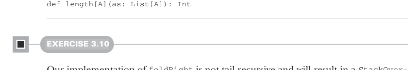
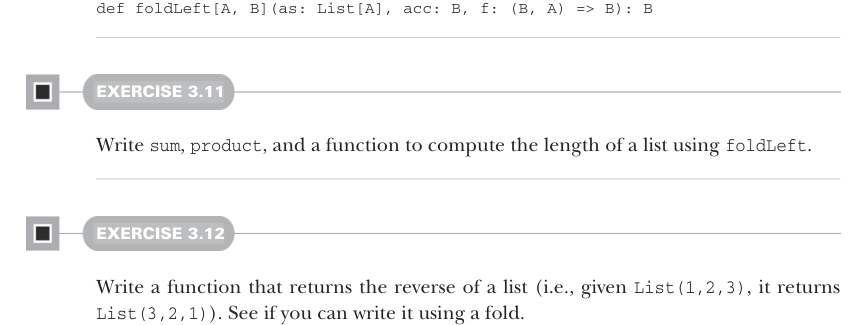
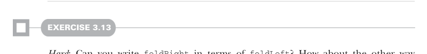

# Page 0075

[<- Page 0074](./page-0074) | [Pages index](./) | [Page 0076 ->](./page-0076)

> Part 1: Introduction to functional programming / Chapter 3: Functional data structures / 3.3 Data sharing in functional data structures / 3.3.2 Recursion over lists and generalizing to higher-order functions


#### EXERCISE 3.9

Compute the length of a list using `foldRight`:



```scala
def length[A](as: List[A]): Int
```

#### EXERCISE 3.10

Our implementation of `foldRight` is not tail recursive and will result in a `StackOver-`flowError` for large lists (we say it’s not *stack safe*). Convince yourself that this is the case, and then write another general list-recursion function, `foldLeft`, that is tail recursive, using the techniques we discussed in the previous chapter. Start collapsing from the leftmost start of the list. Here is its signature:9



```scala
def foldLeft[A, B](as: List[A], acc: B, f: (B, A) => B): B
```

#### EXERCISE 3.11

Write `sum`, `product`, and a function to compute the length of a list using `foldLeft`.

#### EXERCISE 3.12

Write a function that returns the reverse of a list (i.e., given `List(1,2,3)`, it returns `List(3,2,1)`). See if you can write it using a fold.



#### EXERCISE 3.13

*Hard*: Can you write `foldRight` in terms of `foldLeft`? How about the other way around? Implementing `foldRight` via `foldLeft` is useful because it lets us implement `foldRight` tail recursively, which means it works even for large lists without overflowing the stack.

9 Again, `foldLeft` is defined as a method of `List` in the Scala standard library, and it is curried similarly for better type inference, so you can write `mylist.foldLeft(0.0)(_ + _)`.

[<- Page 0074](./page-0074) | [Pages index](./) | [Page 0076 ->](./page-0076)
