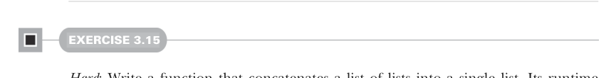
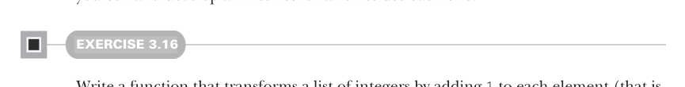
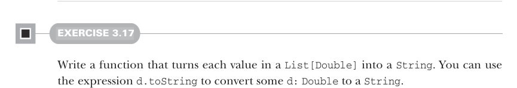

# Page 0076

[<- Page 0075](./page-0075) | [Pages index](./) | [Page 0077 ->](./page-0077)

> Part 1: Introduction to functional programming / Chapter 3: Functional data structures / 3.3 Data sharing in functional data structures / 3.3.3 More functions for working with lists

## 47 3.3 Data sharing in functional data structures


#### EXERCISE 3.14

Recall the signature of `append`:

```scala
def append[A](a1: List[A], a2: List[A]): List[A]
```

Implement `append` in terms of either `foldLeft` or `foldRight` instead of structural recursion.



#### EXERCISE 3.15

*Hard*: Write a function that concatenates a list of lists into a single list. Its runtime should be linear in the total length of all lists. Try to use functions we have already defined.

### 3.3.3 More functions for working with lists

There are many more useful functions for working with lists. We’ll cover a few more here to get additional practice with generalizing functions and some basic familiarity with common patterns when processing lists. After finishing this section, you’re not going to emerge with an automatic sense of when to use each of these functions; just get in the habit of looking for possible ways to generalize any explicit recursive functions you write to process lists. If you do this, you’ll (re)discover these functions for yourself and develop an instinct for when to use each one.



#### EXERCISE 3.16

Write a function that transforms a list of integers by adding `1` to each element (that is, given a list of integers, it returns a new list of integers where each value is one more than the corresponding value in the original list).



#### EXERCISE 3.17

Write a function that turns each value in a `List[Double]` into a `String`. You can use the expression `d.toString` to convert some `d:` `Double` to a `String`.

[<- Page 0075](./page-0075) | [Pages index](./) | [Page 0077 ->](./page-0077)
