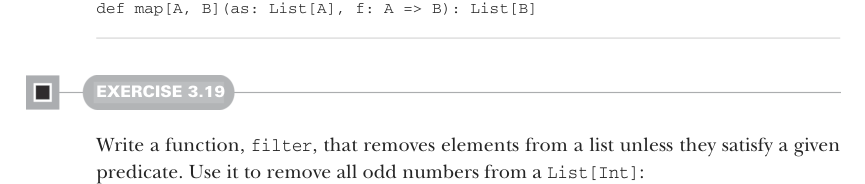

# Page 0077

[<- Page 0076](./page-0076) | [Pages index](./) | [Page 0078 ->](./page-0078)

> Part 1: Introduction to functional programming / Chapter 3: Functional data structures / 3.3 Data sharing in functional data structures / 3.3.3 More functions for working with lists


#### EXERCISE 3.18

Write a function, `map`, that generalizes modifying each element in a list while maintaining the structure of the list. Here is its signature:10



```scala
def map[A, B](as: List[A], f: A => B): List[B]
```

#### EXERCISE 3.19

Write a function, `filter`, that removes elements from a list unless they satisfy a given predicate. Use it to remove all odd numbers from a `List[Int]`:


```scala
def filter[A](as: List[A], f: A => Boolean): List[A]
```

#### EXERCISE 3.20

Write a function, `flatMap`, that works like `map` except that the function given will return a list instead of a single result, ensuring that the list is inserted into the final resulting list. Here is its signature:11

```scala
def flatMap[A, B](as: List[A], f: A => List[B]): List[B]
```

For instance, `flatMap(List(1,` `2,` `3),` `i` `=>` `List(i,i))` should result in `List(1,` `1,` `2,` `2,` `3,` `3)`.


#### EXERCISE 3.21

Use `flatMap` to implement `filter`.

#### EXERCISE 3.22

Write a function that accepts two lists and constructs a new list by adding corresponding elements. For example, `List(1,2,3)` and `List(4,5,6)` become `List(5,7,9)`.

10In the standard library, `map` is a method on `List`. 11In the standard library, `flatMap` is a method on `List`.

[<- Page 0076](./page-0076) | [Pages index](./) | [Page 0078 ->](./page-0078)
