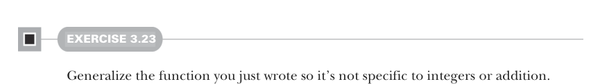

# Page 0078

[<- Page 0077](./page-0077) | [Pages index](./) | [Page 0079 ->](./page-0079)

> Part 1: Introduction to functional programming / Chapter 3: Functional data structures / 3.3 Data sharing in functional data structures / 3.3.4 Loss of efficiency when assembling list functions from simpler components

## 49 3.3 Data sharing in functional data structures

#### EXERCISE 3.23

Generalize the function you just wrote so it’s not specific to integers or addition.

LISTS IN THE STANDARD LIBRARY `List` exists in the Scala standard library (API documentation at http://mng.bz/y9qE), and we’ll use the standard library version in subsequent chapters. The main difference between the `List` developed here and the standard library version is that `Cons` is called `::`, which associates to the right,12 so `1` `::` `2` `::` `Nil` is equal to `1` `::` `(2` `::` `Nil)`, which is equal to `List(1,2)`. When pattern matching, `case` `Cons(h,t)` becomes `case` `h` `::` `t`, which avoids having to nest parentheses if writing a pattern like case `h` `::` `h2` `::` `t` to extract more than just the first element of the `List`. There are a number of other useful methods on the standard library lists. You may want to try experimenting with these and other methods in the REPL after reading the API documentation. These are defined as methods on `List[A]` rather than as standalone functions, as we’ve done in this chapter:

 `def` `take(n:` `Int):` `List[A]`—It returns a list consisting of the first `n` elements of `this`.

 `def` `takeWhile(f:` `A` `=>` `Boolean):` `List[A]`—It returns a list consisting of the longest valid prefix of `this` whose elements all pass the predicate `f`.

 `def` `forall(f:` `A` `=>` `Boolean):` `Boolean`—It returns `true` if and only if all elements of `this` pass the predicate `f`.

 `def` `exists(f:` `A` `=>` `Boolean):` `Boolean`—It returns `true` if any element of `this` passes the predicate `f`.

 `scanLeft` and `scanRight`—These are similar to `foldLeft` and `foldRight`, but they return the `List` of partial results rather than just the final accumulated value.

We recommend you look through the Scala API documentation after finishing this chapter to see what other functions there are. If you find yourself writing an explicit recursive function for doing some sort of list manipulation, check the `List` API to see if something like the function you need already exists.

### 3.3.4 Loss of efficiency when assembling list functions from simpler components One of the problems with List is that although we often express operations and algorithms in terms of general-purpose functions, the resulting implementation isn’t always efficient—we may end up making multiple passes over the same input or else have to write explicit recursive loops to allow early termination.

12In Scala, all methods whose names end in `:` are right associative. That is, the expression `x` `::` `xs` is actually the method call `xs.::(x)`, which in turn calls the data constructor `::(x,xs)`. See the Scala language specification for more information.

[<- Page 0077](./page-0077) | [Pages index](./) | [Page 0079 ->](./page-0079)
