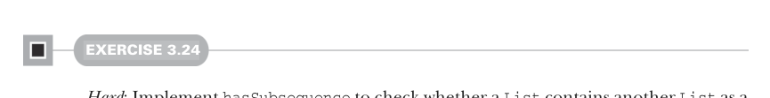

# Page 0079

[<- Page 0078](./page-0078) | [Pages index](./) | [Page 0080 ->](./page-0080)

> Part 1: Introduction to functional programming / Chapter 3: Functional data structures / 3.4 Trees



#### EXERCISE 3.24

*Hard*: Implement `hasSubsequence` to check whether a `List` contains another `List` as a subsequence. For instance, `List(1,2,3,4)` would have `List(1,2)`, `List(2,3)`, and `List(4)` as subsequences, among others. You may have some difficulty finding a concise and purely functional implementation that is also efficient—that’s OK. Implement the function in whatever manner comes most naturally. We’ll return to this implementation in chapter 5 and hopefully improve upon it. Note that any two values `x` and `y` can be compared for equality in Scala using the expression `x` `==` `y`.

```scala
def hasSubsequence[A](sup: List[A], sub: List[A]): Boolean
```

### 3.4 Trees

`List` is just one example of what’s called an *algebraic data type* (ADT). (Somewhat confusingly, ADT is sometimes used elsewhere to stand for *abstract data type*.) An ADT is just a data type defined by one or more data constructors, each of which may contain zero or more arguments. We say that the data type is the *sum* or *union* of its data constructors, and each data constructor is the *product* of its arguments—hence the name *algebraic* data type.13


Tuple types in Scala Pairs and tuples of higher arities (e.g., triples) are also algebraic data types. They work just like the ADTs we’ve been writing here but have special syntax:

```scala
scala> val p = ("Bob", 42)
val p: (String, Int) = (Bob,42)
scala> p(0)
val res0: String = Bob
scala> p(1)
val res1: Int = 42
scala> p match { case (a, b) => b }
val res2: Int = 42
```

In this example, `("Bob",` `42)` is a pair whose type is `(String,` `Int)`, which is syntactic sugar for `Tuple2[String,` `Int]` (see the API: http://mng.bz/1F2N). We can extract the first or second element of this pair by index, and we can pattern match on this pair much like any other `case` `class`. If we try passing an invalid index—e.g., 3 or -1—we get a *compilation* error, not a runtime error. Higher arity tuples work similarly; try experimenting with them in the REPL if you’re interested.

13The naming is not coincidental. There’s a deep connection, beyond the scope of this book, between the “addition” and “multiplication” of types to form an ADT and the addition and multiplication of numbers.

[<- Page 0078](./page-0078) | [Pages index](./) | [Page 0080 ->](./page-0080)
