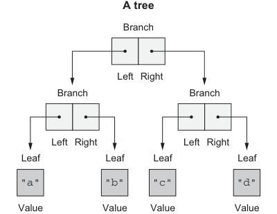
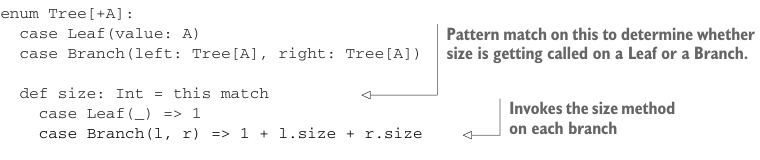

# Page 0080

[<- Page 0079](./page-0079) | [Pages index](./) | [Page 0081 ->](./page-0081)

> Part 1: Introduction to functional programming / Chapter 3: Functional data structures / 3.4 Trees

## 51 3.4 Trees

Algebraic data types can be used to define other data structures. Let’s define a simple binary tree data structure:

```scala
enum Tree[+A]:
case Leaf(value: A)
case Branch(left: Tree[A], right: Tree[A])
```



**A tree**

Branch

Right Left

Branch

Branch

Right Left

Right Left

Leaf

Leaf

Leaf

Leaf

```scala
"a"
"b"
"c"
"d"
```

Value

Value

Value

Value

```scala
Branch(Branch(Leaf("a"), Leaf("b")),
       Branch(Leaf("c"), Leaf("d")))
```

Figure 3.4 Example tree structure

Pattern matching again provides a convenient way of operating over elements of our ADT. Let’s write a function, `size`, that counts the number of nodes (leaves and branches) in a tree:



```scala
enum Tree[+A]:
case Leaf(value: A)
case Branch(left: Tree[A], right: Tree[A])
```

> Pattern match on this to determine whether size is getting called on a Leaf or a Branch.

```scala
def size: Int = this match
case Leaf(_) => 1
case Branch(l, r) => 1 + l.size + r.size
```

> Invokes the size method on each branch

The `size` operation is defined as a method on `Tree`, allowing the method to be called in an object-oriented style. This simplifies both the definition of the `size` function as well as its usage. Consider the definition of `size` as a standalone function:

```scala
object Tree:
def size[A](t: Tree[A]): Int = t match
case Leaf(_) => 1
case Branch(l, r) => 1 + size(l) + size(r)
```

Theses two definitions are very similar! The method syntax allows simpler call sites (`t.size` instead of `size(t)`) and simpler method signatures. When writing data structures we have the choice of using methods or functions—experiment with both.

[<- Page 0079](./page-0079) | [Pages index](./) | [Page 0081 ->](./page-0081)
