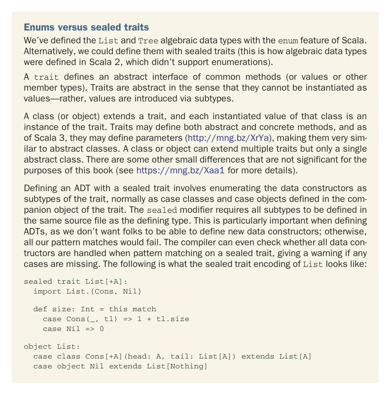

# Page 0083

[<- Page 0082](./page-0082) | [Pages index](./) | [Page 0084 ->](./page-0084)

> Part 1: Introduction to functional programming / Chapter 3: Functional data structures / 3.4 Trees


#### EXERCISE 3.28

Generalize `size`, `maximum`, `depth`, and `map`, writing a new function, `fold`, that abstracts over their similarities. Reimplement them in terms of this more general function. Can you draw an analogy between this `fold` function and the left and right folds for `List`?



Enums versus sealed traits We’ve defined the `List` and `Tree` algebraic data types with the `enum` feature of Scala. Alternatively, we could define them with sealed traits (this is how algebraic data types were defined in Scala 2, which didn’t support enumerations).

A `trait` defines an abstract interface of common methods (or values or other member types). Traits are abstract in the sense that they cannot be instantiated as values—rather, values are introduced via subtypes.

A class (or object) extends a trait, and each instantiated value of that class is an instance of the trait. Traits may define both abstract and concrete methods, and as of Scala 3, they may define parameters (http://mng.bz/XrYa), making them very similar to abstract classes. A class or object can extend multiple traits but only a single abstract class. There are some other small differences that are not significant for the purposes of this book (see https://mng.bz/Xaa1 for more details).

Defining an ADT with a sealed trait involves enumerating the data constructors as subtypes of the trait, normally as case classes and case objects defined in the companion object of the trait. The `sealed` modifier requires all subtypes to be defined in the same source file as the defining type. This is particularly important when defining ADTs, as we don’t want folks to be able to define new data constructors; otherwise, all our pattern matches would fail. The compiler can even check whether all data contructors are handled when pattern matching on a sealed trait, giving a warning if any cases are missing. The following is what the sealed trait encoding of `List` looks like:

```scala
sealed trait List[+A]:
import List.{Cons, Nil}
def size: Int = this match
case Cons(_, tl) => 1 + tl.size
case Nil => 0
object List:
case class Cons[+A](head: A, tail: List[A]) extends List[A]
case object Nil extends List[Nothing]
```

[<- Page 0082](./page-0082) | [Pages index](./) | [Page 0084 ->](./page-0084)
