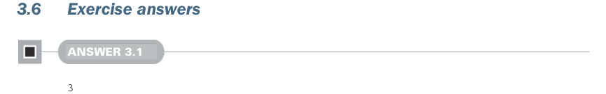

# Page 0085

[<- Page 0084](./page-0084) | [Pages index](./) | [Page 0086 ->](./page-0086)

> Part 1: Introduction to functional programming / Chapter 3: Functional data structures / 3.6 Exercise answers

With singly linked lists, some operations can be implemented with no copying, like prepending an element to the front of a list. Other operations require copying the entire structure, like appending an element to the end of a list.

Many algorithms can be implemented with recursion on the structure of an algebraic data type, with a base case associated with one data constructor and recursive cases associated with other data constructors.

 `foldRight` and `foldLeft` allow us to compute a single result by visiting all the values of a list.

 `map`, `filter`, and `flatMap` are higher-order functions that compute a new list from an input list.

Extension methods allow object-oriented style methods to be defined for a type in an ad hoc fashion separate from the definition of the type.



### 3.6 Exercise answers

#### ANSWER 3.1

```scala
3
```

The cases are checked in order of appearance:

The first case fails to match because the innermost `Cons` in the pattern requires a `4`, but the value being matched contains a `3` in that position.

The second case fails to match because our list of five elements starts with a `Cons` value, not a `Nil`.

The third case binds `1` to `x` and `2` to `y`, matches `3` and `4`, and then discards the final `Cons(5,` `Nil)` using the wildcard pattern. Since the third case matches, the right-hand side of the case (after the `=>`) is evaluated with the `x` `=` `1` and `y` `=` `2` bindings, resulting in the value `3`.

The final two cases are not consulted at all, since the third case matched, but both of them would have matched as well! Experiment with commenting out the various cases.


#### ANSWER 3.2

```scala
def tail[A](as: List[A]): List[A] = as match
case Cons(_, tl) => tl
case Nil => sys.error("tail of empty list")
```

This definition starts by pattern matching on the supplied list. Our list can be either a `Cons` constructor or a `Nil` constructor. In the case of the `Cons` constructor, we use the `_` pattern binding to ignore the head, and we bind the name `tl` to the tail, which

[<- Page 0084](./page-0084) | [Pages index](./) | [Page 0086 ->](./page-0086)
