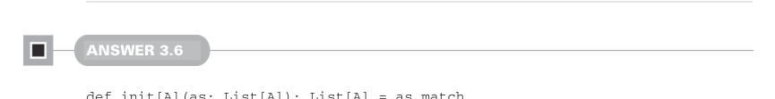

# Page 0087

[<- Page 0086](./page-0086) | [Pages index](./) | [Page 0088 ->](./page-0088)

> Part 1: Introduction to functional programming / Chapter 3: Functional data structures / 3.6 Exercise answers


#### ANSWER 3.5

```scala
def dropWhile[A](as: List[A], f: A => Boolean): List[A] =
as match
case Cons(hd, tl) if f(hd) => dropWhile(tl, f)
case _ => as
```

We pattern match on the list, but our cases are a little different this time. Our first case matches a `Cons` constructor, which has a head that passes the supplied predicate. We implement this using a *pattern guard*—a conditional on the pattern expressed using `if` `<condition>`. In this case, we bind `hd` and `tl` to the head and tail of the `Cons` constructor and use the guard `if` `f(hd)`. This case only matches when `f(hd)` evaluates to `true`, in which case we call `dropWhile` recursively on `tl`. The remaining cases—a `Cons` constructor for which `f(hd)` evaluates to `false` and the `Nil` constructor—match the wildcard case and result in returning the input list. Note that we didn’t need to use pattern guards here. Instead, we could have matched solely on the structure of the input list:

```scala
def dropWhile[A](as: List[A], f: A => Boolean): List[A] =
as match
case Cons(hd, tl) =>
if f(hd) then dropWhile(tl, f)
else as
case Nil => as
```

Either approach is fine in such a small example. It’s good to be familiar with both approaches and choose the one that’s easier to read on a case-by-case basis.



#### ANSWER 3.6

```scala
def init[A](as: List[A]): List[A] = as match
case Nil => sys.error("init of empty list")
case Cons(_, Nil) => Nil
case Cons(hd, tl) => Cons(hd, init(tl))
```

We pattern match on the input list. If we encounter a `Nil`, we immediately error (like we did in `tail`). If instead we encounter a `Cons(_,` `Nil)`, we know we have a list of one element, which we discard and return `Nil`. Otherwise, we must have a `Cons(hd,` `tl)` where `tl` is nonempty (that is, it’s not equal to `Nil`, or we would have matched it already). Hence, we compute the `init` of the tail and then cons our `hd` on to the result. The runtime of `init` is proportional to the length of the list as a result of traversing each `Cons` value. Furthermore, we have to build up a copy of the entire list, as there’s no structural sharing between the initial list and the result of `init`. Finally, this

[<- Page 0086](./page-0086) | [Pages index](./) | [Page 0088 ->](./page-0088)
