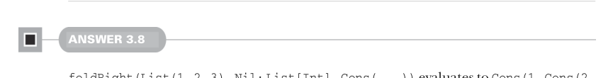
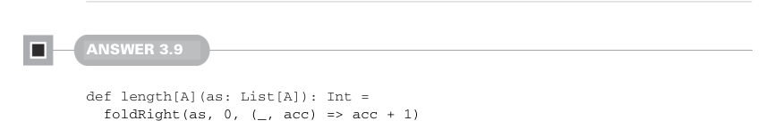

# Page 0088

[<- Page 0087](./page-0087) | [Pages index](./) | [Page 0089 ->](./page-0089)

> Part 1: Introduction to functional programming / Chapter 3: Functional data structures / 3.6 Exercise answers

## 59 3.6 Exercise answers

implementation uses a stack frame for each element of the list, resulting in the potential for stack overflow errors for large lists. We’ll see how to write recursive functions without accumulating stack frames in a bit.


#### ANSWER 3.7

No, this is not possible. `foldRight` recurses all the way to the end of the list before invoking the function. A full traversal has occurred before the supplied function is ever invoked. We’ll cover early termination in chapter 5.



#### ANSWER 3.8

`foldRight(List(1,` `2,` `3),` `Nil:` `List[Int],` `Cons(_,` `_))` evaluates to `Cons(1,` `Cons(2,` `Cons(3,` `Nil)))`. Recall that `foldRight(as,` `acc,` `f)` replaces `Nil` with `acc` and `Cons` with `f`. When we set `acc` to `Nil` and `f` to `Cons`, our replacements are all identities.



#### ANSWER 3.9

```scala
def length[A](as: List[A]): Int =
foldRight(as, 0, (_, acc) => acc + 1)
```

We call `foldRight` with an initial accumulator of 0 and a function that adds 1 to the accumulator for each element it encounters.


#### ANSWER 3.10

```scala
@annotation.tailrec
def foldLeft[A, B](as: List[A], acc: B, f: (B, A) => B): B =
as match
case Nil => acc
case Cons(hd, tl) => foldLeft(tl, f(acc, hd), f)
```

We pattern match on the supplied list: if it’s `Nil`, we return the accumulated result, and if it’s a `Cons`, we compute a new accumulator by calling `f` with the current accumulator and the head of the `Cons` cell. We then recursively call `foldLeft`, passing the tail and the new accumulator. This implementation is tail recursive because there is no additional work to do after the recursive call completes. We have the Scala compiler ensure it is tail recursive by adding the `@annotation.tailrec` annotation.

[<- Page 0087](./page-0087) | [Pages index](./) | [Page 0089 ->](./page-0089)
