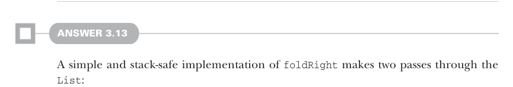

# Page 0089

[<- Page 0088](./page-0088) | [Pages index](./) | [Page 0090 ->](./page-0090)

> Part 1: Introduction to functional programming / Chapter 3: Functional data structures / 3.6 Exercise answers


#### ANSWER 3.11

```scala
def sum(ints: List[Int]): Int =
foldLeft(ints, 0, _ + _)
def product(ds: List[Double]): Double =
foldLeft(ds, 1.0, _ * _)
```


```scala
def length[A](as: List[A]): Int =
foldLeft(as, 0, (acc, _) => acc + 1)
```

#### EXERCISE 3.12

```scala
def reverse[A](as: List[A]): List[A] =
foldLeft(as, Nil: List[A], (acc, a) => Cons(a, acc))
```

We use `foldLeft` with an initial accumulator of an empty list and `Cons(a,` `acc)` as the combining function. As a result of `foldLeft` walking through the elements left to right, the resulting list is built right to left, yielding a list in the reverse order.



#### ANSWER 3.13

A simple and stack-safe implementation of `foldRight` makes two passes through the `List`:

```scala
def foldRightViaFoldLeft[A, B](as: List[A], acc: B, f: (A, B) => B): B =
foldLeft(reverse(as), acc, (b, a) => f(a, b))
```

We first reverse the input list and then `foldLeft` with the result, flipping the order of the parameters passed to the combining function. A different technique is interesting for theoretical reasons and works equally well for `foldRight` in terms of `foldLeft` as well as `foldLeft` in terms of `foldRight`. The trick is to accumulate a function `B` `=>` `B` instead of accumulating a single value of type `B`. In both cases, we start with the identity function on type `B` as the initial accumulator: `(b:` `B)` `=>` `b`. When implementing `foldRight` via `foldLeft` and using an accumulator of type `B` `=>` `B`, the combining function passed to `foldLeft` ends up with the type `(B` `=>` `B,` `A)` `=>` `(B` `=>` `B)`. This is a function of two arguments; the first argument is a function from `B` to `B`, and the second argument is an `A`. The function returns a new function from `B` to `B`. That’s a bit hard to follow, so let’s write out some types. Our combining function will take the following shape: `(g:` `B` `=>` `B,` `a:` `A)` `=>` `???:` `(B` `=>` `B)`. Since we need to return a

[<- Page 0088](./page-0088) | [Pages index](./) | [Page 0090 ->](./page-0090)
