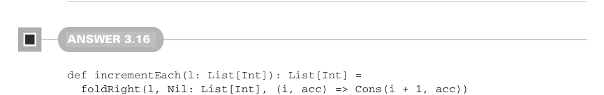

# Page 0090

[<- Page 0089](./page-0089) | [Pages index](./) | [Page 0091 ->](./page-0091)

> Part 1: Introduction to functional programming / Chapter 3: Functional data structures / 3.6 Exercise answers

## 61 3.6 Exercise answers

function from `B` to `B`, we can return an anonymous function. Expanding that, we get `(g:` `B` `=>` `B,` `a:` `A)` `=>` `(b:` `B)` `=>` `???:` `B`. We can follow the types from here; we have an `a:` `A`, a `b:` `B`, a function `g:` `B` `=>` `B`, and a function `f:` `(A,` `B)` `=>` `B`. We can apply `a` and `b` to `f` and apply the result to `g`. Putting all of that together gives us our implementation:

```scala
def foldRightViaFoldLeft[A, B](as: List[A], acc: B, f: (A, B) => B): B =
foldLeft(as, (b: B) => b, (g, a) => b => g(f(a, b)))(acc)
```

Note that the result of `foldLeft(as,` `(b:` `B)` `=>` `b,` `(g,` `a)` `=>` `b` `=>` `g(f(a,` `b)))` gives us a final function of `B` `=>` `B`. We apply the initial `acc` to that function to get our result `B`. We can use the same trick to implement `foldLeft` in terms of `foldRight`:

```scala
def foldLeftViaFoldRight[A, B](as: List[A], acc: B, f: (B, A) => B): B =
foldRight(as, (b: B) => b, (a, g) => b => g(f(b, a)))(acc)
```

Note that neither of these tricky implementations are stack safe as a result of function composition not being stack safe. Each iteration through the combining function grows our accumulator by an additional anonymous function. Nonetheless, these implementations are hinting at something deeper, which we’ll revisit in chapter 10.


#### ANSWER 3.14

```scala
def append[A](xs: List[A], ys: List[A]): List[A] =
foldRight(xs, ys, Cons(_, _))
```

Recall that `foldRight` replaces `Nil` with the initial accumulator. Hence, we replace `Nil` in the first list with the entire second list.


#### ANSWER 3.15

```scala
def concat[A](l: List[List[A]]): List[A] =
foldRight(l, Nil: List[A], append)
```

We combine each inner list with the accumulated `List[A]` using our `append` function from exercise 3.14.



#### ANSWER 3.16

```scala
def incrementEach(l: List[Int]): List[Int] =
foldRight(l, Nil: List[Int], (i, acc) => Cons(i + 1, acc))
```

[<- Page 0089](./page-0089) | [Pages index](./) | [Page 0091 ->](./page-0091)
