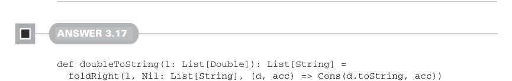
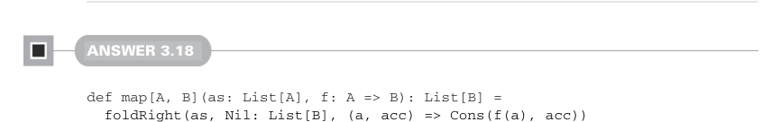
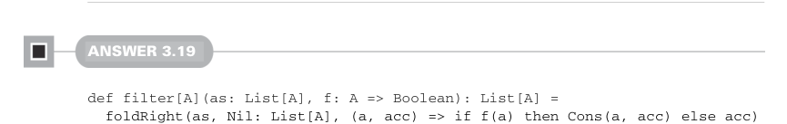
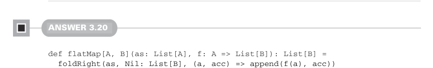

# Page 0091

[<- Page 0090](./page-0090) | [Pages index](./) | [Page 0092 ->](./page-0092)

> Part 1: Introduction to functional programming / Chapter 3: Functional data structures / 3.6 Exercise answers

We use `foldRight`, so we can build the result list in the correct order while using `Cons` as our combining function. Before we create a `Cons` value, we increment the integer passed to the combining function.



#### ANSWER 3.17

```scala
def doubleToString(l: List[Double]): List[String] =
foldRight(l, Nil: List[String], (d, acc) => Cons(d.toString, acc))
```

We use the same strategy here as we did in `incrementEach`: a `foldRight` that uses `Cons` in the combining function. The only difference is calling `d.toString` instead of `i` `+` `1`.



#### ANSWER 3.18

```scala
def map[A, B](as: List[A], f: A => B): List[B] =
foldRight(as, Nil: List[B], (a, acc) => Cons(f(a), acc))
```

We again use the same strategy of a `foldRight`, with `Cons` as the combining function. We’ve simply factored out the common structure between `incrementEach` and `doubleToString`. Note that our implementation is only stack safe if `foldRight` is stack safe. Our initial implementation of `foldRight` wasn’t stack safe, but we showed one way it could be made stack safe by using `reverse` and `foldLeft` internally.



#### ANSWER 3.19

```scala
def filter[A](as: List[A], f: A => Boolean): List[A] =
foldRight(as, Nil: List[A], (a, acc) => if f(a) then Cons(a, acc) else acc)
```

This implementation is similar to `map`, except we only create a new `Cons` cell when the predicate passes.



#### ANSWER 3.20

```scala
def flatMap[A, B](as: List[A], f: A => List[B]): List[B] =
foldRight(as, Nil: List[B], (a, acc) => append(f(a), acc))
```

Here we `foldRight` again, first converting an `A` to a `List[B]` and then combining that with our accumulated `List[B]`. Alternatively, we could use `map` and `concat`:

[<- Page 0090](./page-0090) | [Pages index](./) | [Page 0092 ->](./page-0092)
