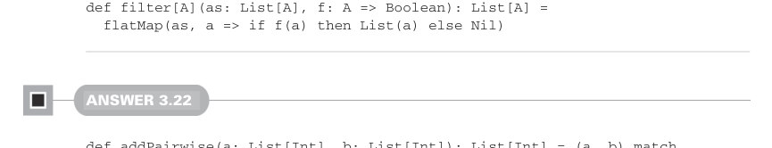

# Page 0092

[<- Page 0091](./page-0091) | [Pages index](./) | [Page 0093 ->](./page-0093)

> Part 1: Introduction to functional programming / Chapter 3: Functional data structures / 3.6 Exercise answers

## 63 3.6 Exercise answers


```scala
def flatMap[A, B](as: List[A], f: A => List[B]): List[B] =
concat(map(as, f))
```

#### ANSWER 3.21



```scala
def filter[A](as: List[A], f: A => Boolean): List[A] =
flatMap(as, a => if f(a) then List(a) else Nil)
```

#### ANSWER 3.22

```scala
def addPairwise(a: List[Int], b: List[Int]): List[Int] = (a, b) match
case (Nil, _) => Nil
case (_, Nil) => Nil
case (Cons(h1, t1), Cons(h2, t2)) => Cons(h1 + h2, addPairwise(t1, t2))
```

We construct a pair from our input lists and pattern match on the result. If either input list is empty, we return an empty list. Otherwise, both are `Cons` cells, so we bind names to their heads (`h1` and `h2`) and tails (`t1` and `t2`) and then construct a new `Cons` cell whose head is `h1` `+` `h2` and whose tail is the result of calling `addPairwise` on the tails. This implementation is not tail recursive because the result of the recursive call is used to subsequently create a `Cons` cell.


#### ANSWER 3.23

```scala
def zipWith[A, B, C](a: List[A], b: List[B], f: (A, B) => C): List[C] =
(a, b) match
case (Nil, _) => Nil
case (_, Nil) => Nil
case (Cons(h1, t1), Cons(h2, t2)) => Cons(f(h1, h2), zipWith(t1, t2, f))
```

We’ve made two generalizations here; first, we factored out the `+` operation into a function that’s passed to `zipWith` as a parameter, and second, we allowed the types of each list to be different. Hence, we need three type parameters—two for the input lists and one for the result list. To make this stack safe, we can pass the accumulated value into our recursive call instead of first recursing and then using the result in subsequent computation:

```scala
def zipWith[A, B, C](a: List[A], b: List[B], f: (A, B) => C): List[C] =
@annotation.tailrec
def loop(a: List[A], b: List[B], acc: List[C]): List[C] =
(a, b) match
case (Nil, _) => acc
case (_, Nil) => acc
case (Cons(h1, t1), Cons(h2, t2)) => loop(t1, t2, Cons(f(h1, h2), acc))
reverse(loop(a, b, Nil))
```

[<- Page 0091](./page-0091) | [Pages index](./) | [Page 0093 ->](./page-0093)
