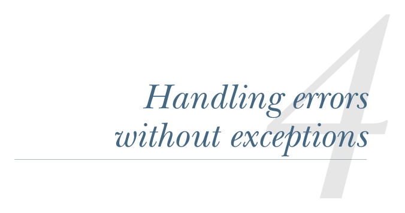

# Page 0096

[<- Page 0095](./page-0095) | [Pages index](./) | [Page 0097 ->](./page-0097)

> Part 1: Introduction to functional programming / Chapter 4: Handling errors without exceptions

## Handling errors without exceptions

### This chapter covers

Discussing the disadvantages of exceptions

Introducing the `Option` data type

Introducing the `Either` data type

Introducing the `Try` data type

We noted briefly in chapter 1 that throwing exceptions is a side effect. If exceptions aren’t used in functional code, what is used instead? In this chapter, we’ll learn the basic principles for raising and handling errors functionally. The big idea is that we can represent failures and exceptions with ordinary values, and we can write higher-order functions that abstract out common patterns of error handling and recovery. The functional solution of returning errors as values is safer and retains referential transparency, and through the use of higher-order functions, we can preserve the primary benefit of exceptions: *consolidation of error-handling logic*. We’ll see how this works over the course of this chapter after we take a closer look at exceptions and discuss some of their problems.

**67**

[<- Page 0095](./page-0095) | [Pages index](./) | [Page 0097 ->](./page-0097)
