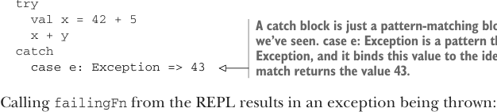
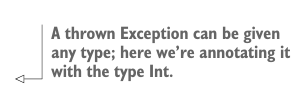

# Page 0097

[<- Page 0096](./page-0096) | [Pages index](./) | [Page 0098 ->](./page-0098)

> Part 1: Introduction to functional programming / Chapter 4: Handling errors without exceptions / 4.1 The good and bad aspects of exceptions

For the same reason that we created our own `List` data type in the previous chapter, we’ll recreate two Scala standard library types in this chapter: `Option` and `Either`. Our aim here is to enhance your understanding of how these types can be used for handling errors. After completing this chapter, you should feel free to use the Scala standard library version of `Option` and `Either` (though you’ll notice that the standard library versions of both types are missing some of the useful functions we define in this chapter).

### 4.1 The good and bad aspects of exceptions

Why do exceptions break referential transparency, and why is that a problem? Let’s look at a simple example; we’ll define a function that throws an exception and call it.

Listing 4.1 Throwing and catching an exception


> val y: Int = … declares y as having the type Int and sets it equal to the righthand side of =.

```scala
def failingFn(i: Int): Int =
val y: Int = throw Exception("fail!")
try
val x = 42 + 5
x + y
catch
```



> A catch block is just a pattern-matching block like the ones we’ve seen. case e: Exception is a pattern that matches any Exception, and it binds this value to the identifier e. The match returns the value 43.

```scala
case e: Exception => 43
```

Calling `failingFn` from the REPL results in an exception being thrown:

```scala
scala> failingFn(12)
java.lang.Exception: fail!
at failingFn(<console>:8)
...
```

We can prove `y` is not referentially transparent. Recall that any RT expression may be substituted with the value it refers to, and this substitution should preserve program meaning. If we substitute `throw` `Exception("fail!")` for `y` in `x` `+` `y`, it produces a different result because the exception will now be raised inside a `try` block that will catch the exception and return `43`:



```scala
def failingFn2(i: Int): Int =
try
val x = 42 + 5
x + ((throw Exception("fail!")): Int)
catch
```

> A thrown Exception can be given any type; here we’re annotating it with the type Int.

```scala
case e: Exception => 43
```

We can demonstrate this in the REPL:

```scala
scala> failingFn2(12)
res1: Int = 43
```

[<- Page 0096](./page-0096) | [Pages index](./) | [Page 0098 ->](./page-0098)
