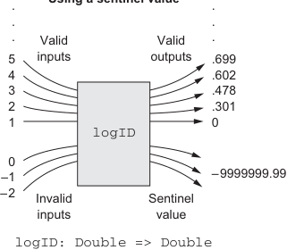

# Page 0101

[<- Page 0100](./page-0100) | [Pages index](./) | [Page 0102 ->](./page-0102)

> Part 1: Introduction to functional programming / Chapter 4: Handling errors without exceptions / 4.3 The Option data type / 4.3.1 Usage patterns for Option

The return type now reflects the possibility that the result may not always be defined. We still always return a result of the declared type (now `Option[Double]`) from our function, so `mean` is now a *total function*, meaning it takes each value of the input type to exactly one value of the output type. Figure 4.1 contrasts using sentinel values with using the `Option` type.

**Responding to invalid inputs**

**Using a sentinel value**

**Using the Option type**



...


...

...

...

Valid inputs Valid outputs

Valid inputs Valid outputs

5 4 3 2 1

5 4 3 2 1

.699.602.478.301 0

Some(.699) Some(.602) Some(.478) Some(.301) Some(0)

```scala
logID
logID
```

0 –1 –2

0 –1 –2

–9999999.99

None

Invalid inputs Sentinel value

Invalid inputs Invalid output

```scala
logID: Double => Double
logID: Double => Option[Double]
```

> Mapping all invalid inputs to a special value of the same type as the valid outputs. The choice of the special value is ambiguous, and the compiler can’t check that the caller handles it correctly.

> Every valid output is wrapped in Some. Invalid inputs are mapped to None. The compiler forces the caller to deal explicitly with the possibility of failure.

Figure 4.1 Techniques for making a function total while responding to invalid inputs

### 4.3.1 Usage patterns for Option

Partial functions abound in programming, and `Option` (and the `Either` data type that we’ll discuss shortly) is typically how this partiality is dealt with in FP. You’ll see `Option` used throughout the Scala standard library in the following cases, for instance:

 `Map` lookup for a given key (http://mng.bz/g1qv) returns `Option`.

 `headOption` and `lastOption` defined for lists and other iterables (http://mng.bz/ePqV) return an `Option` containing the first or last elements of a sequence if it’s nonempty.

These examples aren’t comprehensive; we’ll see `Option` come up in many different situations. What makes `Option` convenient is that we can factor out common patterns of error handling via higher-order functions, freeing us from writing the usual boilerplate that comes with exception-handling code. In this section, we’ll cover some of the basic functions for working with `Option`. Our goal here is not attaining fluency with all these functions but getting familiar enough that you can revisit this chapter and make progress on your own when you have to write some functional code to deal with errors.

[<- Page 0100](./page-0100) | [Pages index](./) | [Page 0102 ->](./page-0102)
