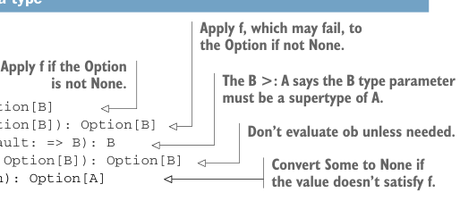

# Page 0102

[<- Page 0101](./page-0101) | [Pages index](./) | [Page 0103 ->](./page-0103)

> Part 1: Introduction to functional programming / Chapter 4: Handling errors without exceptions / 4.3 The Option data type / 4.3.1 Usage patterns for Option

## 73 4.3 The Option data type

BASIC FUNCTIONS ON OPTION `Option` can be thought of like a `List` that can contain at most one element, and many of the `List` functions we saw earlier have analogous functions on `Option`. Let’s look at some of these functions. Like we did with the functions on `Tree` in chapter 3, we’ll place our functions inside the body of the `Option` type so they can be called with the `obj.fn(arg)` syntax. This choice raises one additional complication with regard to variance that we’ll discuss in a moment. Let’s take a look.

Listing 4.2 The `Option` data type



> Apply f, which may fail, to the Option if not None.

```scala
enum Option[+A]:
case Some(get: A)
case None
```

> Apply f if the Option is not None.

> The B >: A says the B type parameter must be a supertype of A.

```scala
def map[B](f: A => B): Option[B]
def flatMap[B](f: A => Option[B]): Option[B]
def getOrElse[B >: A](default: => B): B
def orElse[B >: A](ob: => Option[B]): Option[B]
def filter(f: A => Boolean): Option[A]
```

> Don’t evaluate ob unless needed.

> Convert Some to None if the value doesn’t satisfy f.

There is some new syntax here. The `default:` `=>` `B` type annotation in `getOrElse` (and the similar annotation in `orElse`) indicates that the argument is of type `B`, but it won’t be evaluated until it’s needed by the function. Don’t worry about this for now; we’ll talk much more about this concept of *nonstrictness* in the next chapter. Also, the `B` `>:` `A` type parameter on the `getOrElse` and `orElse` functions indicates that `B` must be equal to or a *supertype* of `A`. It’s needed to convince Scala that it’s still safe to declare `Option[+A]` as covariant in `A`. See the chapter notes (https://github.com/fpinscala/fpinscala/wiki) for more details. It’s unfortunately somewhat complicated but a necessary complication in Scala; fortunately, fully understanding subtyping and variance isn’t essential for our purposes.


#### EXERCISE 4.1

Implement all of the preceding functions on `Option`. As you implement each function, try to think about what it means and in what situations you’d use it. We’ll explore when to use each of these functions next. Here are a few hints for solving this exercise:

It’s fine to use pattern matching, though you should be able to implement all the functions besides `map` and `getOrElse` without resorting to pattern matching. Try implementing `flatMap`, `orElse`, and `filter` in terms of `map` and `getOrElse`.

For `map` and `flatMap`, the type signature should be enough to determine the implementation.

 `getOrElse` returns the result inside the `Some` case of the `Option`, or if the `Option` is `None`, it returns the given default value.

[<- Page 0101](./page-0101) | [Pages index](./) | [Page 0103 ->](./page-0103)
