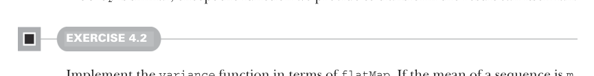

# Page 0103

[<- Page 0102](./page-0102) | [Pages index](./) | [Page 0104 ->](./page-0104)

> Part 1: Introduction to functional programming / Chapter 4: Handling errors without exceptions / 4.3 The Option data type / 4.3.1 Usage patterns for Option

 `orElse` returns the first `Option` if it’s defined; otherwise, it returns the second `Option`.

USAGE SCENARIOS FOR THE BASIC OPTION FUNCTIONS Although we can explicitly pattern match on an `Option`, we’ll almost always use the preceding higher-order functions. Here we’ll try to provide some guidance for when to use each one. Fluency with these functions will come with practice, but the objective here is to get some basic familiarity. Next time you try writing some functional code that uses `Option`, see if you can recognize the patterns these functions encapsulate before you resort to pattern matching. Let’s start with `map`. The `map` function can be used to transform the result inside an `Option`, if it exists. We can think of it as proceeding with a computation on the assumption that an error hasn’t occurred; it’s also a way of deferring the error handling to later code:

```scala
case class Employee(
name: String,
department: String,
manager: Option[Employee])
def lookupByName(name: String): Option[Employee] = ...
val joeDepartment: Option[String] =
lookupByName("Joe").map(_.department)
```

Here `lookupByName("Joe")` returns an `Option[Employee]`, which we transform to an `Option[String]` using `map` to pull out the department. Note that we don’t need to explicitly check the result of `lookupByName("Joe")`; we simply continue the computation as if no error occurred inside the argument to `map`. If `lookupByName("Joe")` returns `None`, this will abort the rest of the computation, and `map` will not call the `_.department` function at all. Figure 4.2 shows additional chained computations. `flatMap` is similar, except the function we provide to transform the result can itself fail.



#### EXERCISE 4.2

Implement the `variance` function in terms of `flatMap`. If the mean of a sequence is `m`, the variance is the mean of `math.pow(x` `-` `m,` `2)` for each element `x` in the sequence. See the definition of variance on Wolfram MathWorld (https://mng.bz/7ZgQ):

```scala
def mean(xs: Seq[Double]): Option[Double] =
if xs.isEmpty then None
else Some(xs.sum / xs.length)
def variance(xs: Seq[Double]): Option[Double]
```

[<- Page 0102](./page-0102) | [Pages index](./) | [Page 0104 ->](./page-0104)
