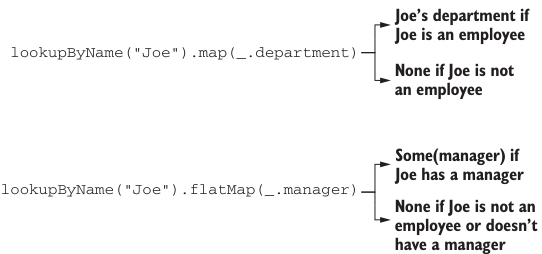

# Page 0104

[<- Page 0103](./page-0103) | [Pages index](./) | [Page 0105 ->](./page-0105)

> Part 1: Introduction to functional programming / Chapter 4: Handling errors without exceptions / 4.3 The Option data type / 4.3.1 Usage patterns for Option

## 75 4.3 The Option data type



> Joe’s department if Joe is an employee

```scala
lookupByName("Joe").map(_.department)
```

> None if Joe is not an employee

> Some(manager) if Joe has a manager

```scala
lookupByName("Joe").flatMap(_.manager)
```

> None if Joe is not an employee or doesn’t have a manager


> Joe’s department if he has one

```scala
lookupByName("Joe").map(_.department).getOrElse("Default Dept.")
```

> “Default Dept.” if not

Figure 4.2 Chaining computations that work with Option

As the implementation of `variance` demonstrates, with `flatMap` we can construct a computation with multiple stages, any of which may fail, and the computation will abort as soon as the first failure is encountered, since `None.flatMap(f)` will immediately return `None`, without running `f`. We can use `filter` to convert successes into failures if the successful values don’t match the given predicate. A common pattern is transforming an `Option` via calls to `map`, `flatMap`, and/or `filter` and then using `getOrElse` to do error handling at the end:

```scala
val dept: String =
lookupByName("Joe").
map(_.department).
filter(_ != "Accounting").
getOrElse("Default Dept")
```

`getOrElse` is used here to convert from an `Option[String]` to a `String` by providing a default department in case the key `"Joe"` didn’t exist in the `Map` or Joe’s department was `"Accounting"`. `orElse` is similar to `getOrElse`, except that we return another `Option` if the first is undefined. This is often useful when we need to chain together possibly failing computations, trying the second if the first hasn’t succeeded. A common idiom is using `o.getOrElse(throw` `Exception("FAIL"))` to convert the `None` case of an `Option` back to an exception. The general rule is using exceptions only if no reasonable program would ever catch the exception; if for some callers the exception might be a recoverable error, we use `Option` (or `Either`, as discussed later) to give them flexibility. When in doubt, avoid the use of exceptions, especially when getting started—what may seem like a good use case for exceptions often ends up better expressed with values due to unfamiliarity.

[<- Page 0103](./page-0103) | [Pages index](./) | [Page 0105 ->](./page-0105)
