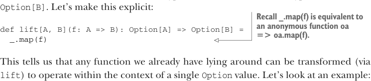

# Page 0105

[<- Page 0104](./page-0104) | [Pages index](./) | [Page 0106 ->](./page-0106)

> Part 1: Introduction to functional programming / Chapter 4: Handling errors without exceptions / 4.3 The Option data type / 4.3.2 Option composition, lifting, and wrapping exception-oriented APIs

As you can see, returning errors as ordinary values can be convenient, and the use of higher-order functions lets us achieve the same sort of consolidation of errorhandling logic that we would get from using exceptions. Note that we don’t have to check for `None` at each stage of the computation; we can apply several transformations and then check for and handle `None` when we’re ready. But we also get additional safety, since `Option[A]` is a different type than `A`, and the compiler won’t let us forget to explicitly defer or handle the possibility of `None`.

### 4.3.2 Option composition, lifting, and wrapping exception-oriented APIs

It may be easy to jump to the conclusion that once we start using `Option`, it spreads throughout our entire code base. One can imagine how any callers of methods that take or return `Option` will have to be modified to handle either `Some` or `None`, but this doesn’t happen because we can *lift* ordinary functions to become functions that operate on `Option`. For example, the `map` function lets us operate on values of the `Option[A]` type using a function of the `A` `=>` `B` type, which returns `Option[B]`. Another way of looking at this is that `map` turns a function `f` of type `A` `=>` `B` into a function of type `Option[A]` `=>` `Option[B]`. Let’s make this explicit:



> Recall _.map(f) is equivalent to an anonymous function oa => oa.map(f).

```scala
def lift[A, B](f: A => B): Option[A] => Option[B] =
_.map(f)
```

This tells us that any function we already have lying around can be transformed (via `lift`) to operate within the context of a single `Option` value. Let’s look at an example:

```scala
val absO: Option[Double] => Option[Double] =
lift(math.abs)
scala> val ex1 = absO(Some(-1.0))
val ex1: Option[Double] = Some(1.0)
```

Figure 4.3 breaks this example down further.

**Lifting functions**

```scala
lift(math.abs):
Option[Double] => Option[Double]
```


```scala
Double => Double
math.abs:
```

> lift(f) returns a function which maps None to None and applies f to the contents of Some. f need not be aware of the Option type at all.

Figure 4.3 Lifting a function to work with Options

The `math` object contains various standalone mathematical functions, including `abs`, `sqrt`, `exp`, and so on. We didn’t need to rewrite the `math.abs` function to work with

[<- Page 0104](./page-0104) | [Pages index](./) | [Page 0106 ->](./page-0106)
