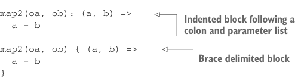

# Page 0107

[<- Page 0106](./page-0106) | [Pages index](./) | [Page 0108 ->](./page-0108)

> Part 1: Introduction to functional programming / Chapter 4: Handling errors without exceptions / 4.3 The Option data type / 4.3.2 Option composition, lifting, and wrapping exception-oriented APIs

But there’s a problem—after we parse `optAge` and `optTickets` into `Option[Int]`, how do we call `insuranceRateQuote`, which currently takes two `Int` values? Do we have to rewrite `insuranceRateQuote` to take `Option[Int]` values instead? No, and changing `insuranceRateQuote` would be entangling concerns, forcing it to be aware that a prior computation may have failed, not to mention that we may not have the ability to modify `insuranceRateQuote`—perhaps it’s defined in a separate module we don’t have access to. Instead, we’d like to lift `insuranceRateQuote` to operate in the context of two optional values. We could do this by using explicit pattern matching in the body of `parseInsuranceRateQuote`, but that’s going to be tedious.


#### EXERCISE 4.3

Write a generic function `map2` that combines two `Option` values using a binary function. If either `Option` value is `None`, then the return value is too. Here is its signature:

```scala
def map2[A, B, C](a: Option[A], b: Option[B])(f: (A, B) => C): Option[C]
```

Note that we have two parameter lists here; the first parameter list takes an `Option[A]` and an `Option[B]`, and the second parameter list takes a function `(A,` `B)` `=>` `C`. To call this function, we supply values for each parameter list—for example, `map2(oa,` `ob)` `(_` `+` `_)`. We could have defined this with a single parameter list instead, though it’s common style to use two parameter lists when a function takes multiple parameters and the last parameter is itself a function.3 Doing so allows a syntax variation when passing multiline anonymous functions, where the final parameter list is replaced with either an indented block or a brace delimited block:



```scala
map2(oa, ob): (a, b) =>
a + b
```

> Indented block following a colon and parameter list

```scala
map2(oa, ob) { (a, b) =>
a + b
}
```

> Brace delimited block

We’ll use indented blocks in this book, but feel free to experiment with both styles.

3 There was another benefit of multiple parameter lists in Scala 2: better type inference. Scala 2 inferred type parameters on each parameter list in succession. If Scala 2 was able to infer a concrete type in the first parameter list, then any appearance of that type in subsequent parameter lists would be fixed (i.e., not further inferred or generalized). For example, `map(List(1, 2, 3), _ + 1)` from chapter 3 would fail to compile with a type inference error, but had we defined `map` with two parameter lists, resulting in usage like `map(List(1,` `2, 3))(_ + 1)`, compilation would have succeeded. Scala 3 can infer type parameters from all parameter lists simultaneously, so there are no longer type inference advantages to using multiple parameter lists.

[<- Page 0106](./page-0106) | [Pages index](./) | [Page 0108 ->](./page-0108)
