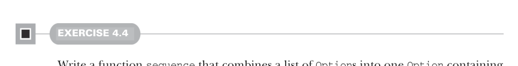

# Page 0108

[<- Page 0107](./page-0107) | [Pages index](./) | [Page 0109 ->](./page-0109)

> Part 1: Introduction to functional programming / Chapter 4: Handling errors without exceptions / 4.3 The Option data type / 4.3.2 Option composition, lifting, and wrapping exception-oriented APIs

## 79 4.3 The Option data type

With `map2` we can now implement `parseInsuranceRateQuote`:


> If either parse fails, this will immediately return None.

```scala
def parseInsuranceRateQuote(
age: String,
numberOfSpeedingTickets: String): Option[Double] =
val optAge: Option[Int] = toIntOption(age)
val optTickets: Option[Int] = toIntOption(numberOfSpeedingTickets)
map2(optAge, optTickets)(insuranceRateQuote)
```

The `map2` function means we never need to modify any existing functions of two arguments to make them `Option`-aware. We can lift them to operate in the context of `Option` after the fact. Can you already see how you might define `map3`, `map4`, and `map5`? Let’s look at a few other similar cases.



#### EXERCISE 4.4

Write a function `sequence` that combines a list of `Option`s into one `Option` containing a list of all the `Some` values in the original list. If the original list contains `None` even once, the result of the function should be `None`; otherwise, the result should be `Some`, with a list of all the values. Here is its signature:4

```scala
def sequence[A](as: List[Option[A]]): Option[List[A]]
```

Sometimes we’ll want to map over a list using a function that might fail, returning `None` if applying it to any element of the list returns `None`. For example, what if we have a whole list of `String` values that we wish to parse to `Option[Int]`? In that case, we can simply sequence the results of the `map`:

```scala
def parseInts(as: List[String]): Option[List[Int]] =
sequence(as.map(a => toIntOption(s)))
```

Unfortunately, this is inefficient since it traverses the list twice—first to convert each `String` to an `Option[Int]` and second to combine these `Option[Int]` values into an `Option[List[Int]]`. Wanting to sequence the results of a `map` this way is a common enough occurrence to warrant a new generic function, `traverse`, with the following signature:

```scala
def traverse[A, B](as: List[A])(f: A => Option[B]): Option[List[B]]
```

4 This is a clear instance in which it’s not appropriate to define the function in the OO style. This shouldn’t be a method on `List` (which shouldn’t need to know anything about `Option`), and it can’t be a method on `Option`, so it goes in the `Option` companion object.

[<- Page 0107](./page-0107) | [Pages index](./) | [Page 0109 ->](./page-0109)
