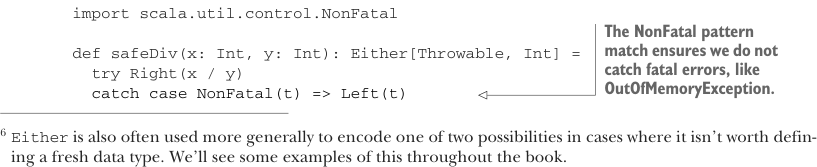

# Page 0110

[<- Page 0109](./page-0109) | [Pages index](./) | [Page 0111 ->](./page-0111)

> Part 1: Introduction to functional programming / Chapter 4: Handling errors without exceptions / 4.4 The Either data type

## 81 4.4 The Either data type

### 4.4 The Either data type

The big idea in this chapter is that we can represent failures and exceptions with ordinary values and write functions that abstract out common patterns of error handling and recovery. `Option` isn’t the only data type we could use for this purpose, and although it gets used frequently, it’s rather simple. You may have noticed that `Option` doesn’t tell us anything about what went wrong in the case of an exceptional condition. All it can do is give us `None`, indicating there’s no value to be had. But sometimes we want to know more. For example, we might want a `String` that provides more information, or if an exception was raised, we might want to know what that error actually was. We can craft a data type that encodes whatever information we want about failures. Sometimes just knowing whether a failure occurred is sufficient, and in that case, we can use `Option`; other times, we want more information. In this section, we’ll walk through a simple extension to `Option`: the `Either` data type, which lets us track a reason for the failure. Let’s look at its definition:

```scala
enum Either[+E, +A]:
case Left(value: E)
case Right(value: A)
```

`Either` has only two cases, just like `Option`. The essential difference is that both cases carry a value. The `Either` data type represents, in a very general way, values that can be one of two things. We can say that it’s a *disjoint union* of two types. When we use it to indicate success or failure, by convention. the `Right` constructor is reserved for the success case (a pun on *right*, meaning correct), and `Left` is used for failure. We’ve given the left type parameter the suggestive name `E` (for `error`).6

Let’s look at the `mean` example again—this time returning a `String` in case of failure:

```scala
import Either.{Left, Right}
def mean(xs: Seq[Double]): Either[String, Double] =
if xs.isEmpty then
Left("mean of empty list!")
else
Right(xs.sum / xs.length)
```

Sometimes we might want to include more information about the error—for example, a stack trace showing the location of the error in the source code. In such cases, we can simply return the exception in the `Left` side of an `Either`:



```scala
import scala.util.control.NonFatal
```

> The NonFatal pattern match ensures we do not catch fatal errors, like OutOfMemoryException.

```scala
def safeDiv(x: Int, y: Int): Either[Throwable, Int] =
try Right(x / y)
catch case NonFatal(t) => Left(t)
```

6`Either` is also often used more generally to encode one of two possibilities in cases where it isn’t worth defining a fresh data type. We’ll see some examples of this throughout the book.

[<- Page 0109](./page-0109) | [Pages index](./) | [Page 0111 ->](./page-0111)
