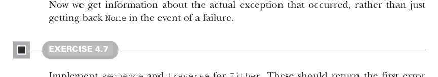

# Page 0111

[<- Page 0110](./page-0110) | [Pages index](./) | [Page 0112 ->](./page-0112)

> Part 1: Introduction to functional programming / Chapter 4: Handling errors without exceptions / 4.4 The Either data type

We can extract a more general function, `catchNonFatal`, which factors out this common pattern of converting thrown exceptions to values:

```scala
def catchNonFatal[A](a: => A): Either[Throwable, A] =
try Right(a)
catch case NonFatal(t) => Left(t)
```


This function is general enough to be defined on the `Either` companion object since it’s not tied to a single use case.

#### EXERCISE 4.6

Implement versions of `map`, `flatMap`, `orElse`, and `map2` on `Either` that operate on the `Right` value:

> When flat mapping over the right side, we must promote the left type parameter to some supertype to satisfy the +E variance annotation. It is similar for orElse.

```scala
enum Either[+E, +A]:
case Left(value: E)
case Right(value: A)
def map[B](f: A => B): Either[E, B]
def flatMap[EE >: E, B](f: A => Either[EE, B]): Either[EE, B]
def orElse[EE >: E,B >: A](b: => Either[EE, B]): Either[EE, B]
def map2[EE >: E, B, C](that: Either[EE, B])(f: (A, B) => C): Either[EE, C]
```

Note that with these definitions, `Either` can now be used in for-comprehensions (recall that for-comprehensions are syntactic sugar for calls to `flatMap`, `map`, and so on). Take the following, for instance:

```scala
def parseInsuranceRateQuote(
age: String,
numberOfSpeedingTickets: String): Either[Throwable,Double] =
for
a <- Either.catchNonFatal(age.toInt)
tickets <- Either.catchNonFatal(numberOfSpeedingTickes.toInt)
yield insuranceRateQuote(a, tickets)
```



Now we get information about the actual exception that occurred, rather than just getting back `None` in the event of a failure.

#### EXERCISE 4.7

Implement `sequence` and `traverse` for `Either`. These should return the first error that’s encountered if there is one:

[<- Page 0110](./page-0110) | [Pages index](./) | [Page 0112 ->](./page-0112)
