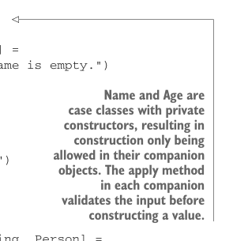

# Page 0112

[<- Page 0111](./page-0111) | [Pages index](./) | [Page 0113 ->](./page-0113)

> Part 1: Introduction to functional programming / Chapter 4: Handling errors without exceptions / 4.4 The Either data type / 4.4.1 Accumulating errors

## 83 4.4 The Either data type

```scala
def sequence[E, A](as: List[Either[E, A]]): Either[E, List[A]]
def traverse[E, A, B](as: List[A])(
f: A => Either[E, B]): Either[E, List[B]]
```

As a final example, here’s an application of `map2` where the function `Person.make` validates both the given name and the given age before constructing a valid `Person`.

Listing 4.4 Using `Either` to validate data



```scala
case class Name private (value: String)
object Name:
def apply(name: String): Either[String, Name] =
if name == "" || name == null then Left("Name is empty.")
else Right(new Name(name))
```

> Name and Age are case classes with private constructors, resulting in construction only being allowed in their companion objects. The apply method in each companion validates the input before constructing a value.

```scala
case class Age private (value: Int)
object Age:
def apply(age: Int): Either[String, Age] =
if age < 0 then Left("Age is out of range.")
else Right(new Age(age))
case class Person(name: Name, age: Age)
object Person:
def make(name: String, age: Int): Either[String, Person] =
Name(name).map2(Age(age))(Person(_, _))
```

### 4.4.1 Accumulating errors

The implementation of `map2` is only able to report one error, even if both arguments are invalid (that is, both arguments are `Left`s`)`. It would be more useful if we could report both errors. For example, when creating a `Person` from a name and age, and both the name and age have failed validation, we might want to present both errors to the user of our program. Let’s create a function similar to `map2` that reports both errors. We’ll need to adjust the return type of the function to return a `List[E]`:

```scala
def map2Both[E, A, B, C](
a: Either[E, A],
b: Either[E, B],
f: (A, B) => C
): Either[List[E], C] =
(a, b) match
case (Right(aa), Right(bb)) => Right(f(aa, bb))
case (Left(e), Right(_)) => Left(List(e))
case (Right(_), Left(e)) => Left(List(e))
case (Left(e1), Left(e2)) => Left(List(e1, e2))
```

[<- Page 0111](./page-0111) | [Pages index](./) | [Page 0113 ->](./page-0113)
