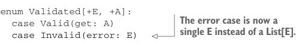

# Page 0116

[<- Page 0115](./page-0115) | [Pages index](./) | [Page 0117 ->](./page-0117)

> Part 1: Introduction to functional programming / Chapter 4: Handling errors without exceptions / 4.4 The Either data type / 4.4.2 Extracting a Validated type

## 87 4.4 The Either data type

Let’s make one further generalization: our `Validated` type accumulates a `List[E]` of errors. Why `List`, though? What if we want to use some other type, like a `Vector`? Or a collection type that requires at least one entry, since an `Invalid(Nil)` doesn’t make much sense? Or maybe a type with some additional structure, like some form of `Tree`? In fact, if we carefully look through the definition of `Validated`, there’s only one place that depends on errors being modeled as a list: in the definition of `map2` when we concatenate the errors from two `Invalid` values. Let’s redefine `Validated` to avoid the direct dependency on `List` for error accumulation:



```scala
enum Validated[+E, +A]:
case Valid(get: A)
case Invalid(error: E)
```

> The error case is now a single E instead of a List[E].

At first glance, it appears we’ve taken a step backward by defining `Validated` very much like `Either` is defined. The key difference between this version of `Validated` and `Either` is in the signature of `map2`. In particular, we need a way to combine two invalid values into a single invalid value. In the previous definition of `Validated`, where `Invalid` wrapped a `List[E]`, our combining action was list concatenation. But with this new definition, we need a way to combine two `E` values into a single `E` value, and we know nothing about `E`. It seems like we’re stuck, but we can modify the signature of `map2` and simply ask for such a combining action:

```scala
enum Validated[+E, +A]:
case Valid(get: A)
case Invalid(error: E)
```


```scala
def map2[EE >: E, B, C](
b: Validated[EE, B])(
f: (A, B) => C)(
combineErrors: (EE, EE) => EE
): Validated[EE, C] =
(this, b) match
case (Valid(aa), Valid(bb)) => Valid(f(aa, bb))
case (Invalid(e), Valid(_)) => Invalid(e)
case (Valid(_), Invalid(e)) => Invalid(e)
case (Invalid(e1), Invalid(e2)) =>
```

> We ask the caller to provide a function that combines two errors into one error.

> In a case in which both inputs are invalid, we use the caller-supplied combining action to merge the errors.

```scala
Invalid(combineErrors(e1, e2))
```

With this version of `Validated`, creating a `Person` would return `Validated[List` `[String],` `Person]`, and since we’re using `List[String]` for the error type, we’d have to pass list concatenation as the value of `combineErrors` when calling `map2`. For example, assuming `Name` and `Age` are also modified to return a `Validated` with `List[String]` as the error type, we could create a `Person` via `Name(name).map2` `(Age(age))(Person(_,` `_))(_` `++` `_)`. Because `traverse` calls `map2`, it must pass a value for `combineErrors`, but `traverse` doesn’t know anything about the error type. Hence, we’ll need to change the signature

[<- Page 0115](./page-0115) | [Pages index](./) | [Page 0117 ->](./page-0117)
